# Analyze a human kidney xenium dataset with CellScopes.jl
This is a script to reproduce the figures in Figure S2. The human kidney xenium data can be downloaded from the 10x website. The single cell RNA-seq data for gene imputation can be accessed from GEO (https://www.ncbi.nlm.nih.gov/geo/query/acc.cgi?acc=GSM4572192).
```julia
import CellScopes as cs

```


<div style="padding: 1em; background-color: #f8d6da; border: 1px solid #f5c6cb; font-weight: bold;">
<p>The WebIO Jupyter extension was not detected. See the
<a href="https://juliagizmos.github.io/WebIO.jl/latest/providers/ijulia/" target="_blank">
    WebIO Jupyter integration documentation
</a>
for more information.
</div>


    Welcome to use CellScopes.jl!


```julia
xenium_dir = "/home/haojiawu/NC_revision/human_kidney_xenium/"
```


    "/home/haojiawu/NC_revision/human_kidney_xenium/"


```julia
@time kidney = cs.read_xenium(xenium_dir; min_gene = 0, min_cell = 0, prefix = "kidney")
```

    Formatting cell polygons...


    Progress: 100%[==================================================] Time: 0:00:02m


    Cell polygons formatted!
    Filtering cells and genes...
    Cells and genes filtered!
    Adding prefix kidney to all cells...
     71.130883 seconds (158.75 M allocations: 11.901 GiB, 4.85% gc time, 60.05% compilation time)


    XeniumObject in CellScopes.jl


    Genes x Cells = 377 x 97511
    Available data:
    - rawCount
    - normCount
    - metaData
    - spmetaData
    - dimReduction
    - polynormCount
    - coordData
    - polygonData
    All fields:
    - rawCount
    - normCount
    - scaleCount
    - metaData
    - spmetaData
    - varGene
    - dimReduction
    - clustData
    - polyCount
    - polynormCount
    - coordData
    - imputeData
    - imageData
    - polygonData


```julia
kidney = cs.normalize_object(kidney)
kidney = cs.scale_object(kidney)
```


    XeniumObject in CellScopes.jl


    Genes x Cells = 377 x 97511
    Available data:
    - rawCount
    - normCount
    - scaleCount
    - metaData
    - spmetaData
    - dimReduction
    - polynormCount
    - coordData
    - polygonData
    All fields:
    - rawCount
    - normCount
    - scaleCount
    - metaData
    - spmetaData
    - varGene
    - dimReduction
    - clustData
    - polyCount
    - polynormCount
    - coordData
    - imputeData
    - imageData
    - polygonData


```julia
kidney = cs.find_variable_genes(kidney; nFeatures=350)
kidney = cs.run_pca(kidney;  method=:svd, pratio = 1, maxoutdim = 20)
```


    XeniumObject in CellScopes.jl


    Genes x Cells = 377 x 97511
    Available data:
    - rawCount
    - normCount
    - scaleCount
    - metaData
    - spmetaData
    - varGene
    - dimReduction
    - polynormCount
    - coordData
    - polygonData
    All fields:
    - rawCount
    - normCount
    - scaleCount
    - metaData
    - spmetaData
    - varGene
    - dimReduction
    - clustData
    - polyCount
    - polynormCount
    - coordData
    - imputeData
    - imageData
    - polygonData


```julia
kidney = cs.run_umap(kidney; min_dist=0.3)
kidney = cs.run_clustering(kidney; res=0.0005)
```


    XeniumObject in CellScopes.jl


    Genes x Cells = 377 x 97511
    Available data:
    - rawCount
    - normCount
    - scaleCount
    - metaData
    - spmetaData
    - varGene
    - dimReduction
    - clustData
    - polynormCount
    - coordData
    - polygonData
    All fields:
    - rawCount
    - normCount
    - scaleCount
    - metaData
    - spmetaData
    - varGene
    - dimReduction
    - clustData
    - polyCount
    - polynormCount
    - coordData
    - imputeData
    - imageData
    - polygonData


```julia
cs.dim_plot(kidney; dim_type = "umap", marker_size = 1)
```


    
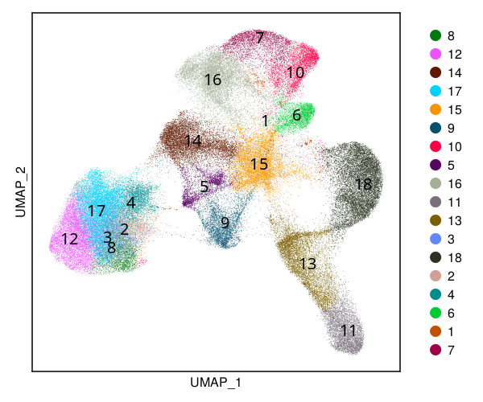
    


```julia
#cs.save(kidney;filename="kidney_julia.jld2")
```


```julia
using StatsBase
```


```julia
StatsBase.countmap(kidney.spmetaData.cell.cluster)
```


    Dict{String, Int64} with 18 entries:
      "4"  => 2823
      "1"  => 464
      "12" => 7276
      "2"  => 2207
      "6"  => 3142
      "11" => 5382
      "13" => 7306
      "15" => 8592
      "5"  => 2916
      "16" => 9341
      "14" => 8429
      "7"  => 3463
      "8"  => 3847
      "17" => 9863
      "10" => 4284
      "9"  => 4012
      "18" => 11756
      "3"  => 2408


```julia
;wget "https://www.ncbi.nlm.nih.gov/geo/download/?acc=GSM4572192&format=file&file=GSM4572192%5FControl1%5Ffiltered%5Ffeature%5Fbc%5Fmatrix%2Eh5"
```

    --2023-09-07 09:19:54--  https://www.ncbi.nlm.nih.gov/geo/download/?acc=GSM4572192&format=file&file=GSM4572192%5FControl1%5Ffiltered%5Ffeature%5Fbc%5Fmatrix%2Eh5
    Resolving www.ncbi.nlm.nih.gov (www.ncbi.nlm.nih.gov)... 130.14.29.110, 2607:f220:41e:4290::110
    Connecting to www.ncbi.nlm.nih.gov (www.ncbi.nlm.nih.gov)|130.14.29.110|:443... connected.
    HTTP request sent, awaiting response... 200 OK
    Length: 25531447 (24M) [application/octet-stream]
    Saving to: ‘index.html?acc=GSM4572192&format=file&file=GSM4572192_Control1_filtered_feature_bc_matrix.h5’
    
         0K .......... .......... .......... .......... ..........  0%  590K 42s
        50K .......... .......... .......... .......... ..........  0% 1.30M 30s
       100K .......... .......... .......... .......... ..........  0% 6.22M 21s
       150K .......... .......... .......... .......... ..........  0% 1.55M 20s
       200K .......... .......... .......... .......... ..........  1% 7.65M 17s
       250K .......... .......... .......... .......... ..........  1% 9.14M 14s
       300K .......... .......... .......... .......... ..........  1% 63.9M 12s
       350K .......... .......... .......... .......... ..........  1% 1.88M 12s
       400K .......... .......... .......... .......... ..........  1% 4.40M 11s
       450K .......... .......... .......... .......... ..........  2% 28.2M 10s
       500K .......... .......... .......... .......... ..........  2% 7.88M 10s
       550K .......... .......... .......... .......... ..........  2% 47.5M 9s
       600K .......... .......... .......... .......... ..........  2% 52.6M 8s
       650K .......... .......... .......... .......... ..........  2% 2.61M 8s
       700K .......... .......... .......... .......... ..........  3% 3.12M 8s
       750K .......... .......... .......... .......... ..........  3% 21.8M 8s
       800K .......... .......... .......... .......... ..........  3% 10.1M 7s
       850K .......... .......... .......... .......... ..........  3% 44.9M 7s
       900K .......... .......... .......... .......... ..........  3% 48.0M 7s
       950K .......... .......... .......... .......... ..........  4% 3.39M 7s
      1000K .......... .......... .......... .......... ..........  4% 2.34M 7s
      1050K .......... .......... .......... .......... ..........  4% 58.2M 7s
      1100K .......... .......... .......... .......... ..........  4% 7.91M 6s
      1150K .......... .......... .......... .......... ..........  4% 45.5M 6s
      1200K .......... .......... .......... .......... ..........  5% 42.6M 6s
      1250K .......... .......... .......... .......... ..........  5% 14.2M 6s
      1300K .......... .......... .......... .......... ..........  5% 2.45M 6s
      1350K .......... .......... .......... .......... ..........  5% 4.28M 6s
      1400K .......... .......... .......... .......... ..........  5% 8.87M 6s
      1450K .......... .......... .......... .......... ..........  6% 50.7M 5s
      1500K .......... .......... .......... .......... ..........  6% 43.5M 5s
      1550K .......... .......... .......... .......... ..........  6% 17.1M 5s
      1600K .......... .......... .......... .......... ..........  6% 3.29M 5s
      1650K .......... .......... .......... .......... ..........  6% 4.64M 5s
      1700K .......... .......... .......... .......... ..........  7% 5.78M 5s
      1750K .......... .......... .......... .......... ..........  7% 56.6M 5s
      1800K .......... .......... .......... .......... ..........  7% 16.1M 5s
      1850K .......... .......... .......... .......... ..........  7% 22.7M 5s
      1900K .......... .......... .......... .......... ..........  7% 52.7M 5s
      1950K .......... .......... .......... .......... ..........  8% 1.36M 5s
      2000K .......... .......... .......... .......... ..........  8% 60.0M 5s
      2050K .......... .......... .......... .......... ..........  8% 71.8M 5s
      2100K .......... .......... .......... .......... ..........  8% 67.6M 5s
      2150K .......... .......... .......... .......... ..........  8% 61.1M 4s
      2200K .......... .......... .......... .......... ..........  9% 10.4M 4s
      2250K .......... .......... .......... .......... ..........  9% 57.6M 4s
      2300K .......... .......... .......... .......... ..........  9% 1.59M 5s
      2350K .......... .......... .......... .......... ..........  9% 21.4M 4s
      2400K .......... .......... .......... .......... ..........  9% 8.15M 4s
      2450K .......... .......... .......... .......... .......... 10% 49.4M 4s
      2500K .......... .......... .......... .......... .......... 10% 58.5M 4s
      2550K .......... .......... .......... .......... .......... 10% 12.6M 4s
      2600K .......... .......... .......... .......... .......... 10% 47.0M 4s
      2650K .......... .......... .......... .......... .......... 10% 3.51M 4s
      2700K .......... .......... .......... .......... .......... 11% 2.51M 4s
      2750K .......... .......... .......... .......... .......... 11% 9.85M 4s
      2800K .......... .......... .......... .......... .......... 11% 56.2M 4s
      2850K .......... .......... .......... .......... .......... 11% 48.3M 4s
      2900K .......... .......... .......... .......... .......... 11% 13.9M 4s
      2950K .......... .......... .......... .......... .......... 12% 53.5M 4s
      3000K .......... .......... .......... .......... .......... 12% 6.30M 4s
      3050K .......... .......... .......... .......... .......... 12% 1.98M 4s
      3100K .......... .......... .......... .......... .......... 12% 28.7M 4s
      3150K .......... .......... .......... .......... .......... 12% 9.94M 4s
      3200K .......... .......... .......... .......... .......... 13% 47.3M 4s
      3250K .......... .......... .......... .......... .......... 13% 45.6M 4s
      3300K .......... .......... .......... .......... .......... 13% 20.4M 4s
      3350K .......... .......... .......... .......... .......... 13% 58.9M 4s
      3400K .......... .......... .......... .......... .......... 13% 2.09M 4s
      3450K .......... .......... .......... .......... .......... 14% 7.91M 4s
      3500K .......... .......... .......... .......... .......... 14% 9.51M 4s
      3550K .......... .......... .......... .......... .......... 14% 10.2M 4s
      3600K .......... .......... .......... .......... .......... 14% 63.7M 4s
      3650K .......... .......... .......... .......... .......... 14% 58.7M 4s
      3700K .......... .......... .......... .......... .......... 15% 10.2M 4s
      3750K .......... .......... .......... .......... .......... 15% 11.5M 3s
      3800K .......... .......... .......... .......... .......... 15% 2.05M 4s
      3850K .......... .......... .......... .......... .......... 15% 7.82M 4s
      3900K .......... .......... .......... .......... .......... 15% 56.4M 3s
      3950K .......... .......... .......... .......... .......... 16% 10.3M 3s
      4000K .......... .......... .......... .......... .......... 16% 62.7M 3s
      4050K .......... .......... .......... .......... .......... 16% 42.5M 3s
      4100K .......... .......... .......... .......... .......... 16% 15.5M 3s
      4150K .......... .......... .......... .......... .......... 16% 4.84M 3s
      4200K .......... .......... .......... .......... .......... 17% 2.96M 3s
      4250K .......... .......... .......... .......... .......... 17% 14.7M 3s
      4300K .......... .......... .......... .......... .......... 17% 58.2M 3s
      4350K .......... .......... .......... .......... .......... 17% 8.22M 3s
      4400K .......... .......... .......... .......... .......... 17% 56.1M 3s
      4450K .......... .......... .......... .......... .......... 18% 11.7M 3s
      4500K .......... .......... .......... .......... .......... 18% 10.5M 3s
      4550K .......... .......... .......... .......... .......... 18% 10.2M 3s
      4600K .......... .......... .......... .......... .......... 18% 2.68M 3s
      4650K .......... .......... .......... .......... .......... 18% 27.4M 3s
      4700K .......... .......... .......... .......... .......... 19% 13.6M 3s
      4750K .......... .......... .......... .......... .......... 19% 7.49M 3s
      4800K .......... .......... .......... .......... .......... 19% 27.1M 3s
      4850K .......... .......... .......... .......... .......... 19% 7.78M 3s
      4900K .......... .......... .......... .......... .......... 19% 60.3M 3s
      4950K .......... .......... .......... .......... .......... 20% 23.0M 3s
      5000K .......... .......... .......... .......... .......... 20% 2.58M 3s
      5050K .......... .......... .......... .......... .......... 20% 60.7M 3s
      5100K .......... .......... .......... .......... .......... 20% 11.2M 3s
      5150K .......... .......... .......... .......... .......... 20% 5.14M 3s
      5200K .......... .......... .......... .......... .......... 21% 46.2M 3s
      5250K .......... .......... .......... .......... .......... 21% 7.65M 3s
      5300K .......... .......... .......... .......... .......... 21% 53.9M 3s
      5350K .......... .......... .......... .......... .......... 21% 58.2M 3s
      5400K .......... .......... .......... .......... .......... 21% 3.44M 3s
      5450K .......... .......... .......... .......... .......... 22% 2.37M 3s
      5500K .......... .......... .......... .......... .......... 22% 63.8M 3s
      5550K .......... .......... .......... .......... .......... 22% 59.4M 3s
      5600K .......... .......... .......... .......... .......... 22% 69.9M 3s
      5650K .......... .......... .......... .......... .......... 22% 42.3M 3s
      5700K .......... .......... .......... .......... .......... 23% 10.6M 3s
      5750K .......... .......... .......... .......... .......... 23% 60.2M 3s
      5800K .......... .......... .......... .......... .......... 23% 42.6M 3s
      5850K .......... .......... .......... .......... .......... 23% 1.56M 3s
      5900K .......... .......... .......... .......... .......... 23% 51.5M 3s
      5950K .......... .......... .......... .......... .......... 24% 7.70M 3s
      6000K .......... .......... .......... .......... .......... 24% 58.4M 3s
      6050K .......... .......... .......... .......... .......... 24% 47.4M 3s
      6100K .......... .......... .......... .......... .......... 24% 42.1M 3s
      6150K .......... .......... .......... .......... .......... 24% 16.9M 3s
      6200K .......... .......... .......... .......... .......... 25% 54.9M 3s
      6250K .......... .......... .......... .......... .......... 25% 45.4M 3s
      6300K .......... .......... .......... .......... .......... 25% 1.77M 3s
      6350K .......... .......... .......... .......... .......... 25% 12.8M 3s
      6400K .......... .......... .......... .......... .......... 25% 7.71M 3s
      6450K .......... .......... .......... .......... .......... 26% 44.2M 3s
      6500K .......... .......... .......... .......... .......... 26% 52.3M 3s
      6550K .......... .......... .......... .......... .......... 26% 37.3M 3s
      6600K .......... .......... .......... .......... .......... 26% 25.3M 3s
      6650K .......... .......... .......... .......... .......... 26% 59.4M 3s
      6700K .......... .......... .......... .......... .......... 27% 11.9M 3s
      6750K .......... .......... .......... .......... .......... 27% 2.10M 3s
      6800K .......... .......... .......... .......... .......... 27% 8.07M 3s
      6850K .......... .......... .......... .......... .......... 27% 40.5M 3s
      6900K .......... .......... .......... .......... .......... 27% 6.77M 3s
      6950K .......... .......... .......... .......... .......... 28% 43.0M 3s
      7000K .......... .......... .......... .......... .......... 28% 42.5M 2s
      7050K .......... .......... .......... .......... .......... 28% 20.6M 2s
      7100K .......... .......... .......... .......... .......... 28% 41.0M 2s
      7150K .......... .......... .......... .......... .......... 28% 50.6M 2s
      7200K .......... .......... .......... .......... .......... 29% 3.36M 2s
      7250K .......... .......... .......... .......... .......... 29% 4.70M 2s
      7300K .......... .......... .......... .......... .......... 29% 10.5M 2s
      7350K .......... .......... .......... .......... .......... 29% 6.69M 2s
      7400K .......... .......... .......... .......... .......... 29% 47.6M 2s
      7450K .......... .......... .......... .......... .......... 30% 45.2M 2s
      7500K .......... .......... .......... .......... .......... 30% 57.7M 2s
      7550K .......... .......... .......... .......... .......... 30% 20.2M 2s
      7600K .......... .......... .......... .......... .......... 30% 50.9M 2s
      7650K .......... .......... .......... .......... .......... 30% 5.96M 2s
      7700K .......... .......... .......... .......... .......... 31% 4.70M 2s
      7750K .......... .......... .......... .......... .......... 31% 4.92M 2s
      7800K .......... .......... .......... .......... .......... 31% 9.39M 2s
      7850K .......... .......... .......... .......... .......... 31% 21.9M 2s
      7900K .......... .......... .......... .......... .......... 31% 11.2M 2s
      7950K .......... .......... .......... .......... .......... 32% 46.9M 2s
      8000K .......... .......... .......... .......... .......... 32% 51.6M 2s
      8050K .......... .......... .......... .......... .......... 32% 42.1M 2s
      8100K .......... .......... .......... .......... .......... 32% 20.9M 2s
      8150K .......... .......... .......... .......... .......... 32% 5.40M 2s
      8200K .......... .......... .......... .......... .......... 33% 4.75M 2s
      8250K .......... .......... .......... .......... .......... 33% 8.21M 2s
      8300K .......... .......... .......... .......... .......... 33% 7.45M 2s
      8350K .......... .......... .......... .......... .......... 33% 42.2M 2s
      8400K .......... .......... .......... .......... .......... 33% 11.2M 2s
      8450K .......... .......... .......... .......... .......... 34% 61.9M 2s
      8500K .......... .......... .......... .......... .......... 34% 12.5M 2s
      8550K .......... .......... .......... .......... .......... 34% 25.5M 2s
      8600K .......... .......... .......... .......... .......... 34% 7.41M 2s
      8650K .......... .......... .......... .......... .......... 34% 14.8M 2s
      8700K .......... .......... .......... .......... .......... 35% 4.40M 2s
      8750K .......... .......... .......... .......... .......... 35% 5.09M 2s
      8800K .......... .......... .......... .......... .......... 35% 56.6M 2s
      8850K .......... .......... .......... .......... .......... 35% 12.6M 2s
      8900K .......... .......... .......... .......... .......... 35% 62.2M 2s
      8950K .......... .......... .......... .......... .......... 36% 43.4M 2s
      9000K .......... .......... .......... .......... .......... 36% 48.2M 2s
      9050K .......... .......... .......... .......... .......... 36% 20.3M 2s
      9100K .......... .......... .......... .......... .......... 36% 48.3M 2s
      9150K .......... .......... .......... .......... .......... 36% 6.51M 2s
      9200K .......... .......... .......... .......... .......... 37% 2.94M 2s
      9250K .......... .......... .......... .......... .......... 37% 43.4M 2s
      9300K .......... .......... .......... .......... .......... 37% 5.10M 2s
      9350K .......... .......... .......... .......... .......... 37% 22.2M 2s
      9400K .......... .......... .......... .......... .......... 37% 61.9M 2s
      9450K .......... .......... .......... .......... .......... 38% 16.8M 2s
      9500K .......... .......... .......... .......... .......... 38% 54.1M 2s
      9550K .......... .......... .......... .......... .......... 38% 36.1M 2s
      9600K .......... .......... .......... .......... .......... 38% 35.9M 2s
      9650K .......... .......... .......... .......... .......... 38% 6.65M 2s
      9700K .......... .......... .......... .......... .......... 39% 2.34M 2s
      9750K .......... .......... .......... .......... .......... 39% 56.8M 2s
      9800K .......... .......... .......... .......... .......... 39% 66.2M 2s
      9850K .......... .......... .......... .......... .......... 39% 9.58M 2s
      9900K .......... .......... .......... .......... .......... 39% 49.8M 2s
      9950K .......... .......... .......... .......... .......... 40% 9.75M 2s
     10000K .......... .......... .......... .......... .......... 40% 39.3M 2s
     10050K .......... .......... .......... .......... .......... 40% 45.8M 2s
     10100K .......... .......... .......... .......... .......... 40% 15.6M 2s
     10150K .......... .......... .......... .......... .......... 40% 56.1M 2s
     10200K .......... .......... .......... .......... .......... 41% 11.3M 2s
     10250K .......... .......... .......... .......... .......... 41% 2.21M 2s
     10300K .......... .......... .......... .......... .......... 41% 38.1M 2s
     10350K .......... .......... .......... .......... .......... 41% 13.6M 2s
     10400K .......... .......... .......... .......... .......... 41% 48.2M 2s
     10450K .......... .......... .......... .......... .......... 42% 58.4M 2s
     10500K .......... .......... .......... .......... .......... 42% 10.7M 2s
     10550K .......... .......... .......... .......... .......... 42% 36.7M 2s
     10600K .......... .......... .......... .......... .......... 42% 56.1M 2s
     10650K .......... .......... .......... .......... .......... 42% 15.2M 2s
     10700K .......... .......... .......... .......... .......... 43% 10.0M 2s
     10750K .......... .......... .......... .......... .......... 43% 2.99M 2s
     10800K .......... .......... .......... .......... .......... 43% 5.91M 2s
     10850K .......... .......... .......... .......... .......... 43% 50.6M 2s
     10900K .......... .......... .......... .......... .......... 43% 16.4M 2s
     10950K .......... .......... .......... .......... .......... 44% 59.5M 2s
     11000K .......... .......... .......... .......... .......... 44% 45.7M 2s
     11050K .......... .......... .......... .......... .......... 44% 12.7M 2s
     11100K .......... .......... .......... .......... .......... 44% 54.0M 2s
     11150K .......... .......... .......... .......... .......... 44% 8.84M 2s
     11200K .......... .......... .......... .......... .......... 45% 68.4M 2s
     11250K .......... .......... .......... .......... .......... 45% 18.7M 2s
     11300K .......... .......... .......... .......... .......... 45% 27.1M 2s
     11350K .......... .......... .......... .......... .......... 45% 2.14M 2s
     11400K .......... .......... .......... .......... .......... 45% 26.6M 2s
     11450K .......... .......... .......... .......... .......... 46% 47.7M 2s
     11500K .......... .......... .......... .......... .......... 46% 46.2M 2s
     11550K .......... .......... .......... .......... .......... 46% 18.9M 2s
     11600K .......... .......... .......... .......... .......... 46% 64.3M 2s
     11650K .......... .......... .......... .......... .......... 46% 14.4M 2s
     11700K .......... .......... .......... .......... .......... 47% 10.2M 2s
     11750K .......... .......... .......... .......... .......... 47% 47.8M 2s
     11800K .......... .......... .......... .......... .......... 47% 12.3M 2s
     11850K .......... .......... .......... .......... .......... 47% 71.4M 2s
     11900K .......... .......... .......... .......... .......... 47% 3.19M 2s
     11950K .......... .......... .......... .......... .......... 48% 7.20M 2s
     12000K .......... .......... .......... .......... .......... 48% 47.0M 2s
     12050K .......... .......... .......... .......... .......... 48% 10.5M 2s
     12100K .......... .......... .......... .......... .......... 48% 54.9M 1s
     12150K .......... .......... .......... .......... .......... 48% 40.5M 1s
     12200K .......... .......... .......... .......... .......... 49% 21.0M 1s
     12250K .......... .......... .......... .......... .......... 49% 28.8M 1s
     12300K .......... .......... .......... .......... .......... 49% 39.1M 1s
     12350K .......... .......... .......... .......... .......... 49% 6.33M 1s
     12400K .......... .......... .......... .......... .......... 49% 67.4M 1s
     12450K .......... .......... .......... .......... .......... 50% 4.72M 1s
     12500K .......... .......... .......... .......... .......... 50% 4.21M 1s
     12550K .......... .......... .......... .......... .......... 50% 26.3M 1s
     12600K .......... .......... .......... .......... .......... 50% 12.6M 1s
     12650K .......... .......... .......... .......... .......... 50% 56.5M 1s
     12700K .......... .......... .......... .......... .......... 51% 53.5M 1s
     12750K .......... .......... .......... .......... .......... 51% 42.1M 1s
     12800K .......... .......... .......... .......... .......... 51% 19.8M 1s
     12850K .......... .......... .......... .......... .......... 51% 52.3M 1s
     12900K .......... .......... .......... .......... .......... 51% 15.1M 1s
     12950K .......... .......... .......... .......... .......... 52% 8.66M 1s
     13000K .......... .......... .......... .......... .......... 52% 12.5M 1s
     13050K .......... .......... .......... .......... .......... 52% 3.84M 1s
     13100K .......... .......... .......... .......... .......... 52% 8.92M 1s
     13150K .......... .......... .......... .......... .......... 52% 11.7M 1s
     13200K .......... .......... .......... .......... .......... 53% 61.2M 1s
     13250K .......... .......... .......... .......... .......... 53% 48.2M 1s
     13300K .......... .......... .......... .......... .......... 53% 42.5M 1s
     13350K .......... .......... .......... .......... .......... 53% 20.4M 1s
     13400K .......... .......... .......... .......... .......... 53% 42.5M 1s
     13450K .......... .......... .......... .......... .......... 54% 51.6M 1s
     13500K .......... .......... .......... .......... .......... 54% 7.15M 1s
     13550K .......... .......... .......... .......... .......... 54% 53.4M 1s
     13600K .......... .......... .......... .......... .......... 54% 7.13M 1s
     13650K .......... .......... .......... .......... .......... 54% 4.44M 1s
     13700K .......... .......... .......... .......... .......... 55% 9.13M 1s
     13750K .......... .......... .......... .......... .......... 55% 9.17M 1s
     13800K .......... .......... .......... .......... .......... 55% 58.9M 1s
     13850K .......... .......... .......... .......... .......... 55% 42.3M 1s
     13900K .......... .......... .......... .......... .......... 55% 12.6M 1s
     13950K .......... .......... .......... .......... .......... 56% 63.0M 1s
     14000K .......... .......... .......... .......... .......... 56% 45.6M 1s
     14050K .......... .......... .......... .......... .......... 56% 36.3M 1s
     14100K .......... .......... .......... .......... .......... 56% 27.2M 1s
     14150K .......... .......... .......... .......... .......... 56% 8.80M 1s
     14200K .......... .......... .......... .......... .......... 57% 6.44M 1s
     14250K .......... .......... .......... .......... .......... 57% 7.83M 1s
     14300K .......... .......... .......... .......... .......... 57% 8.89M 1s
     14350K .......... .......... .......... .......... .......... 57% 7.90M 1s
     14400K .......... .......... .......... .......... .......... 57% 53.8M 1s
     14450K .......... .......... .......... .......... .......... 58% 13.8M 1s
     14500K .......... .......... .......... .......... .......... 58% 23.7M 1s
     14550K .......... .......... .......... .......... .......... 58% 48.6M 1s
     14600K .......... .......... .......... .......... .......... 58% 8.73M 1s
     14650K .......... .......... .......... .......... .......... 58% 65.1M 1s
     14700K .......... .......... .......... .......... .......... 59% 41.5M 1s
     14750K .......... .......... .......... .......... .......... 59% 14.4M 1s
     14800K .......... .......... .......... .......... .......... 59% 12.9M 1s
     14850K .......... .......... .......... .......... .......... 59% 7.59M 1s
     14900K .......... .......... .......... .......... .......... 59% 7.97M 1s
     14950K .......... .......... .......... .......... .......... 60% 4.77M 1s
     15000K .......... .......... .......... .......... .......... 60% 41.1M 1s
     15050K .......... .......... .......... .......... .......... 60% 61.3M 1s
     15100K .......... .......... .......... .......... .......... 60% 15.6M 1s
     15150K .......... .......... .......... .......... .......... 60% 43.9M 1s
     15200K .......... .......... .......... .......... .......... 61% 11.8M 1s
     15250K .......... .......... .......... .......... .......... 61% 34.1M 1s
     15300K .......... .......... .......... .......... .......... 61% 51.4M 1s
     15350K .......... .......... .......... .......... .......... 61% 13.9M 1s
     15400K .......... .......... .......... .......... .......... 61% 12.5M 1s
     15450K .......... .......... .......... .......... .......... 62% 63.0M 1s
     15500K .......... .......... .......... .......... .......... 62% 5.49M 1s
     15550K .......... .......... .......... .......... .......... 62% 52.5M 1s
     15600K .......... .......... .......... .......... .......... 62% 5.70M 1s
     15650K .......... .......... .......... .......... .......... 62% 8.20M 1s
     15700K .......... .......... .......... .......... .......... 63% 55.3M 1s
     15750K .......... .......... .......... .......... .......... 63% 39.4M 1s
     15800K .......... .......... .......... .......... .......... 63% 13.6M 1s
     15850K .......... .......... .......... .......... .......... 63% 12.7M 1s
     15900K .......... .......... .......... .......... .......... 63% 26.5M 1s
     15950K .......... .......... .......... .......... .......... 64% 42.4M 1s
     16000K .......... .......... .......... .......... .......... 64% 14.0M 1s
     16050K .......... .......... .......... .......... .......... 64% 49.4M 1s
     16100K .......... .......... .......... .......... .......... 64% 6.00M 1s
     16150K .......... .......... .......... .......... .......... 64% 25.9M 1s
     16200K .......... .......... .......... .......... .......... 65% 10.4M 1s
     16250K .......... .......... .......... .......... .......... 65% 9.90M 1s
     16300K .......... .......... .......... .......... .......... 65% 6.34M 1s
     16350K .......... .......... .......... .......... .......... 65% 43.8M 1s
     16400K .......... .......... .......... .......... .......... 65% 45.5M 1s
     16450K .......... .......... .......... .......... .......... 66% 44.9M 1s
     16500K .......... .......... .......... .......... .......... 66% 7.78M 1s
     16550K .......... .......... .......... .......... .......... 66% 55.1M 1s
     16600K .......... .......... .......... .......... .......... 66% 47.4M 1s
     16650K .......... .......... .......... .......... .......... 66% 14.9M 1s
     16700K .......... .......... .......... .......... .......... 67% 10.9M 1s
     16750K .......... .......... .......... .......... .......... 67% 10.4M 1s
     16800K .......... .......... .......... .......... .......... 67% 27.4M 1s
     16850K .......... .......... .......... .......... .......... 67% 11.5M 1s
     16900K .......... .......... .......... .......... .......... 67% 10.4M 1s
     16950K .......... .......... .......... .......... .......... 68% 5.68M 1s
     17000K .......... .......... .......... .......... .......... 68% 23.0M 1s
     17050K .......... .......... .......... .......... .......... 68% 59.0M 1s
     17100K .......... .......... .......... .......... .......... 68% 49.8M 1s
     17150K .......... .......... .......... .......... .......... 68% 16.9M 1s
     17200K .......... .......... .......... .......... .......... 69% 10.3M 1s
     17250K .......... .......... .......... .......... .......... 69% 51.2M 1s
     17300K .......... .......... .......... .......... .......... 69% 12.4M 1s
     17350K .......... .......... .......... .......... .......... 69% 54.3M 1s
     17400K .......... .......... .......... .......... .......... 69% 17.3M 1s
     17450K .......... .......... .......... .......... .......... 70% 7.34M 1s
     17500K .......... .......... .......... .......... .......... 70% 27.7M 1s
     17550K .......... .......... .......... .......... .......... 70% 5.08M 1s
     17600K .......... .......... .......... .......... .......... 70% 63.0M 1s
     17650K .......... .......... .......... .......... .......... 70% 9.02M 1s
     17700K .......... .......... .......... .......... .......... 71% 67.8M 1s
     17750K .......... .......... .......... .......... .......... 71% 15.0M 1s
     17800K .......... .......... .......... .......... .......... 71% 25.4M 1s
     17850K .......... .......... .......... .......... .......... 71% 9.83M 1s
     17900K .......... .......... .......... .......... .......... 71% 23.5M 1s
     17950K .......... .......... .......... .......... .......... 72% 58.2M 1s
     18000K .......... .......... .......... .......... .......... 72% 41.8M 1s
     18050K .......... .......... .......... .......... .......... 72% 50.8M 1s
     18100K .......... .......... .......... .......... .......... 72% 4.17M 1s
     18150K .......... .......... .......... .......... .......... 72% 53.5M 1s
     18200K .......... .......... .......... .......... .......... 73% 54.2M 1s
     18250K .......... .......... .......... .......... .......... 73% 4.94M 1s
     18300K .......... .......... .......... .......... .......... 73% 9.75M 1s
     18350K .......... .......... .......... .......... .......... 73% 60.6M 1s
     18400K .......... .......... .......... .......... .......... 73% 45.6M 1s
     18450K .......... .......... .......... .......... .......... 74% 18.6M 1s
     18500K .......... .......... .......... .......... .......... 74% 26.5M 1s
     18550K .......... .......... .......... .......... .......... 74% 12.7M 1s
     18600K .......... .......... .......... .......... .......... 74% 56.8M 1s
     18650K .......... .......... .......... .......... .......... 75% 42.6M 1s
     18700K .......... .......... .......... .......... .......... 75% 16.7M 1s
     18750K .......... .......... .......... .......... .......... 75% 56.8M 1s
     18800K .......... .......... .......... .......... .......... 75% 5.60M 1s
     18850K .......... .......... .......... .......... .......... 75% 27.0M 1s
     18900K .......... .......... .......... .......... .......... 76% 52.0M 1s
     18950K .......... .......... .......... .......... .......... 76% 4.70M 1s
     19000K .......... .......... .......... .......... .......... 76% 10.5M 1s
     19050K .......... .......... .......... .......... .......... 76% 58.0M 1s
     19100K .......... .......... .......... .......... .......... 76% 51.0M 1s
     19150K .......... .......... .......... .......... .......... 77% 26.5M 1s
     19200K .......... .......... .......... .......... .......... 77% 10.9M 1s
     19250K .......... .......... .......... .......... .......... 77% 26.4M 1s
     19300K .......... .......... .......... .......... .......... 77% 48.4M 1s
     19350K .......... .......... .......... .......... .......... 77% 14.7M 1s
     19400K .......... .......... .......... .......... .......... 78% 44.1M 1s
     19450K .......... .......... .......... .......... .......... 78% 13.6M 1s
     19500K .......... .......... .......... .......... .......... 78% 5.54M 1s
     19550K .......... .......... .......... .......... .......... 78% 51.5M 1s
     19600K .......... .......... .......... .......... .......... 78% 51.7M 1s
     19650K .......... .......... .......... .......... .......... 79% 6.36M 1s
     19700K .......... .......... .......... .......... .......... 79% 8.14M 1s
     19750K .......... .......... .......... .......... .......... 79% 25.5M 1s
     19800K .......... .......... .......... .......... .......... 79% 41.9M 0s
     19850K .......... .......... .......... .......... .......... 79% 15.9M 0s
     19900K .......... .......... .......... .......... .......... 80% 57.1M 0s
     19950K .......... .......... .......... .......... .......... 80% 12.3M 0s
     20000K .......... .......... .......... .......... .......... 80% 55.5M 0s
     20050K .......... .......... .......... .......... .......... 80% 45.7M 0s
     20100K .......... .......... .......... .......... .......... 80% 14.9M 0s
     20150K .......... .......... .......... .......... .......... 81% 16.9M 0s
     20200K .......... .......... .......... .......... .......... 81% 9.15M 0s
     20250K .......... .......... .......... .......... .......... 81% 27.1M 0s
     20300K .......... .......... .......... .......... .......... 81% 8.63M 0s
     20350K .......... .......... .......... .......... .......... 81% 10.4M 0s
     20400K .......... .......... .......... .......... .......... 82% 10.8M 0s
     20450K .......... .......... .......... .......... .......... 82% 7.70M 0s
     20500K .......... .......... .......... .......... .......... 82% 40.0M 0s
     20550K .......... .......... .......... .......... .......... 82% 58.8M 0s
     20600K .......... .......... .......... .......... .......... 82% 14.2M 0s
     20650K .......... .......... .......... .......... .......... 83% 36.7M 0s
     20700K .......... .......... .......... .......... .......... 83% 53.8M 0s
     20750K .......... .......... .......... .......... .......... 83% 28.7M 0s
     20800K .......... .......... .......... .......... .......... 83% 41.9M 0s
     20850K .......... .......... .......... .......... .......... 83% 16.9M 0s
     20900K .......... .......... .......... .......... .......... 84% 7.28M 0s
     20950K .......... .......... .......... .......... .......... 84% 45.7M 0s
     21000K .......... .......... .......... .......... .......... 84% 10.2M 0s
     21050K .......... .......... .......... .......... .......... 84% 10.6M 0s
     21100K .......... .......... .......... .......... .......... 84% 8.11M 0s
     21150K .......... .......... .......... .......... .......... 85% 46.7M 0s
     21200K .......... .......... .......... .......... .......... 85% 5.93M 0s
     21250K .......... .......... .......... .......... .......... 85% 53.1M 0s
     21300K .......... .......... .......... .......... .......... 85% 17.1M 0s
     21350K .......... .......... .......... .......... .......... 85% 21.9M 0s
     21400K .......... .......... .......... .......... .......... 86% 42.8M 0s
     21450K .......... .......... .......... .......... .......... 86% 34.1M 0s
     21500K .......... .......... .......... .......... .......... 86% 35.6M 0s
     21550K .......... .......... .......... .......... .......... 86% 33.9M 0s
     21600K .......... .......... .......... .......... .......... 86% 12.8M 0s
     21650K .......... .......... .......... .......... .......... 87% 10.7M 0s
     21700K .......... .......... .......... .......... .......... 87% 8.97M 0s
     21750K .......... .......... .......... .......... .......... 87% 47.7M 0s
     21800K .......... .......... .......... .......... .......... 87% 11.2M 0s
     21850K .......... .......... .......... .......... .......... 87% 9.57M 0s
     21900K .......... .......... .......... .......... .......... 88% 43.9M 0s
     21950K .......... .......... .......... .......... .......... 88% 5.32M 0s
     22000K .......... .......... .......... .......... .......... 88% 50.0M 0s
     22050K .......... .......... .......... .......... .......... 88% 18.3M 0s
     22100K .......... .......... .......... .......... .......... 88% 21.7M 0s
     22150K .......... .......... .......... .......... .......... 89% 46.8M 0s
     22200K .......... .......... .......... .......... .......... 89% 13.0M 0s
     22250K .......... .......... .......... .......... .......... 89% 49.5M 0s
     22300K .......... .......... .......... .......... .......... 89% 56.8M 0s
     22350K .......... .......... .......... .......... .......... 89% 14.5M 0s
     22400K .......... .......... .......... .......... .......... 90% 9.10M 0s
     22450K .......... .......... .......... .......... .......... 90% 49.7M 0s
     22500K .......... .......... .......... .......... .......... 90% 11.1M 0s
     22550K .......... .......... .......... .......... .......... 90% 10.2M 0s
     22600K .......... .......... .......... .......... .......... 90% 61.3M 0s
     22650K .......... .......... .......... .......... .......... 91% 3.64M 0s
     22700K .......... .......... .......... .......... .......... 91% 62.1M 0s
     22750K .......... .......... .......... .......... .......... 91% 38.4M 0s
     22800K .......... .......... .......... .......... .......... 91% 55.4M 0s
     22850K .......... .......... .......... .......... .......... 91% 45.5M 0s
     22900K .......... .......... .......... .......... .......... 92% 44.3M 0s
     22950K .......... .......... .......... .......... .......... 92% 8.72M 0s
     23000K .......... .......... .......... .......... .......... 92% 45.4M 0s
     23050K .......... .......... .......... .......... .......... 92% 40.8M 0s
     23100K .......... .......... .......... .......... .......... 92% 13.4M 0s
     23150K .......... .......... .......... .......... .......... 93% 13.6M 0s
     23200K .......... .......... .......... .......... .......... 93% 30.1M 0s
     23250K .......... .......... .......... .......... .......... 93% 48.5M 0s
     23300K .......... .......... .......... .......... .......... 93% 14.5M 0s
     23350K .......... .......... .......... .......... .......... 93% 11.1M 0s
     23400K .......... .......... .......... .......... .......... 94% 9.84M 0s
     23450K .......... .......... .......... .......... .......... 94% 7.93M 0s
     23500K .......... .......... .......... .......... .......... 94% 51.3M 0s
     23550K .......... .......... .......... .......... .......... 94% 11.7M 0s
     23600K .......... .......... .......... .......... .......... 94% 50.0M 0s
     23650K .......... .......... .......... .......... .......... 95% 50.8M 0s
     23700K .......... .......... .......... .......... .......... 95% 19.2M 0s
     23750K .......... .......... .......... .......... .......... 95% 52.1M 0s
     23800K .......... .......... .......... .......... .......... 95% 10.8M 0s
     23850K .......... .......... .......... .......... .......... 95% 11.3M 0s
     23900K .......... .......... .......... .......... .......... 96% 62.2M 0s
     23950K .......... .......... .......... .......... .......... 96% 16.0M 0s
     24000K .......... .......... .......... .......... .......... 96% 29.2M 0s
     24050K .......... .......... .......... .......... .......... 96% 39.6M 0s
     24100K .......... .......... .......... .......... .......... 96% 11.7M 0s
     24150K .......... .......... .......... .......... .......... 97% 10.6M 0s
     24200K .......... .......... .......... .......... .......... 97% 9.03M 0s
     24250K .......... .......... .......... .......... .......... 97% 7.92M 0s
     24300K .......... .......... .......... .......... .......... 97% 53.2M 0s
     24350K .......... .......... .......... .......... .......... 97% 37.5M 0s
     24400K .......... .......... .......... .......... .......... 98% 15.0M 0s
     24450K .......... .......... .......... .......... .......... 98% 48.3M 0s
     24500K .......... .......... .......... .......... .......... 98% 42.8M 0s
     24550K .......... .......... .......... .......... .......... 98% 12.5M 0s
     24600K .......... .......... .......... .......... .......... 98% 57.8M 0s
     24650K .......... .......... .......... .......... .......... 99% 42.8M 0s
     24700K .......... .......... .......... .......... .......... 99% 47.3M 0s
     24750K .......... .......... .......... .......... .......... 99% 8.12M 0s
     24800K .......... .......... .......... .......... .......... 99% 52.2M 0s
     24850K .......... .......... .......... .......... .......... 99% 21.1M 0s
     24900K .......... .......... .......... ...                  100% 22.4M=2.2s
    
    2023-09-07 09:19:56 (10.9 MB/s) - ‘index.html?acc=GSM4572192&format=file&file=GSM4572192_Control1_filtered_feature_bc_matrix.h5’ saved [25531447/25531447]
    


```julia
;mv 'index.html?acc=GSM4572192&format=file&file=GSM4572192_Control1_filtered_feature_bc_matrix.h5' human_control.h5
```


```julia
ct_mtx = cs.read_10x_h5("human_control.h5")
```


    CellScopes.RawCountObject


    Genes x Cells = 33538 x 6905
    All fields:
    - count_mtx
    - cell_name
    - gene_name


```julia
kidney_sc = cs.scRNAObject(ct_mtx; min_gene=0, min_cell=0)
```


    scRNAObject in CellScopes.jl


    Genes x Cells = 26410 x 6905
    Available data:
    - Raw count
    All fields:
    - rawCount
    - normCount
    - scaleCount
    - metaData
    - varGene
    - dimReduction
    - clustData
    - undefinedData


```julia
kidney_sc = cs.normalize_object(kidney_sc; scale_factor = 10000)
```


    scRNAObject in CellScopes.jl


    Genes x Cells = 26410 x 6905
    Available data:
    - Raw count
    - Normalized count
    All fields:
    - rawCount
    - normCount
    - scaleCount
    - metaData
    - varGene
    - dimReduction
    - clustData
    - undefinedData


```julia
kidney_sc = cs.scale_object(kidney_sc)
```


    scRNAObject in CellScopes.jl


    Genes x Cells = 26410 x 6905
    Available data:
    - Raw count
    - Normalized count
    - Scaled count
    All fields:
    - rawCount
    - normCount
    - scaleCount
    - metaData
    - varGene
    - dimReduction
    - clustData
    - undefinedData


```julia
kidney_sc = cs.find_variable_genes(kidney_sc)
kidney_sc = cs.run_pca(kidney_sc;  method=:svd, pratio = 0.9, maxoutdim = 20)
```


    scRNAObject in CellScopes.jl


    Genes x Cells = 26410 x 6905
    Available data:
    - Raw count
    - Normalized count
    - Scaled count
    - Variable genes
    - PCA data
    All fields:
    - rawCount
    - normCount
    - scaleCount
    - metaData
    - varGene
    - dimReduction
    - clustData
    - undefinedData


```julia
kidney_sc = cs.run_clustering(kidney_sc; res=0.002)
```


    scRNAObject in CellScopes.jl


    Genes x Cells = 26410 x 6905
    Available data:
    - Raw count
    - Normalized count
    - Scaled count
    - Variable genes
    - Clustering data
    - PCA data
    All fields:
    - rawCount
    - normCount
    - scaleCount
    - metaData
    - varGene
    - dimReduction
    - clustData
    - undefinedData


```julia
kidney_sc = cs.run_umap(kidney_sc; min_dist=0.4)
```


    scRNAObject in CellScopes.jl


    Genes x Cells = 26410 x 6905
    Available data:
    - Raw count
    - Normalized count
    - Scaled count
    - Variable genes
    - Clustering data
    - PCA data
    - UMAP data
    All fields:
    - rawCount
    - normCount
    - scaleCount
    - metaData
    - varGene
    - dimReduction
    - clustData
    - undefinedData


```julia
cs.dim_plot(kidney_sc; dim_type = "umap", marker_size = 4)
```


    
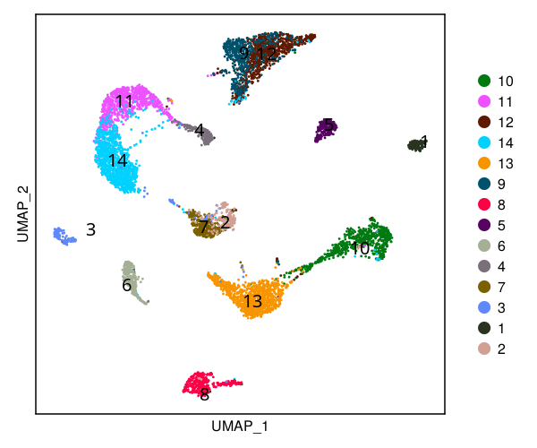
    


```julia
#cs.save(kidney_sc; filename="human_kidney_cs.jld2")
```


```julia
#cs.save(kidney; filename="human_kidney_xn.jld2")
```


```julia
cs.feature_plot(kidney_sc, ["AQP2","UMOD","PODXL"]; 
    order=false, marker_size = 4, 
    count_type ="norm", color_keys=("black","indianred1","red"))
```


    
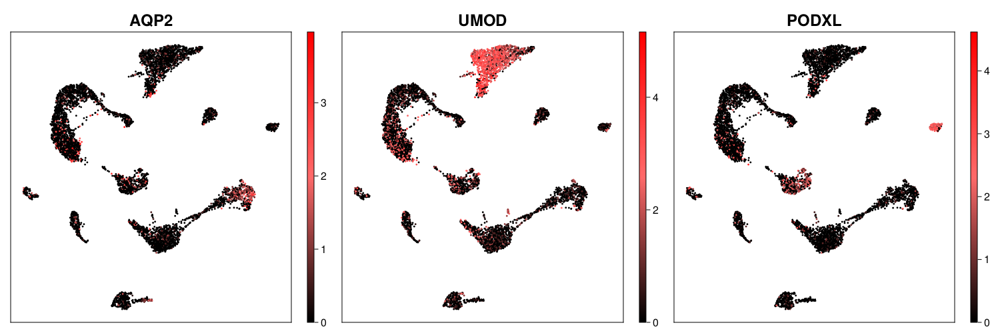
    


```julia
kidney = cs.run_spaGE(kidney, kidney_sc, "/home/haojiawu/NC_revision/compare_seurat/SpaGE/"; 
                gene_list=["THEMIS", "NPHS2", "ELN","SLC12A3", "SLC5A12"])
```


    XeniumObject in CellScopes.jl


    Genes x Cells = 377 x 97511
    Available data:
    - rawCount
    - normCount
    - scaleCount
    - metaData
    - spmetaData
    - varGene
    - dimReduction
    - clustData
    - polynormCount
    - coordData
    - imputeData
    - polygonData
    All fields:
    - rawCount
    - normCount
    - scaleCount
    - metaData
    - spmetaData
    - varGene
    - dimReduction
    - clustData
    - polyCount
    - polynormCount
    - coordData
    - imputeData
    - imageData
    - polygonData


```julia
cs.sp_feature_plot(kidney, ["NPHS2"]; 
    use_imputed=true, 
    color_keys = ["gray94", "lemonchiffon", "red"], width=800, height=250)
```


    
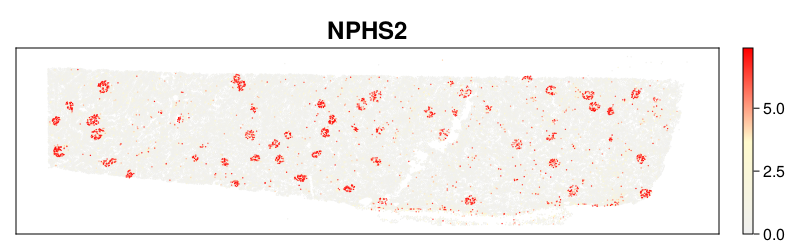
    


```julia
cs.sp_feature_plot(kidney, ["SLC5A12"]; 
    use_imputed=true, 
    color_keys = ["gray94", "lemonchiffon", "red"], width=800, height=250)
```


    
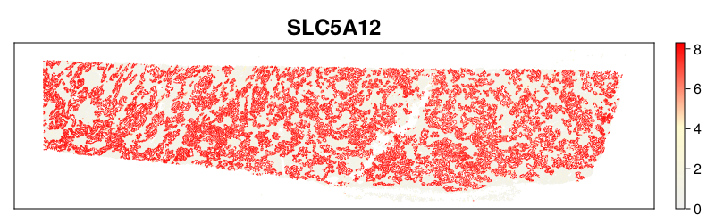
    


```julia
cs.sp_feature_plot(kidney, ["ELN"]; 
    use_imputed=true, 
    color_keys = ["gray94", "lemonchiffon", "red"], width=800, height=250)
```


    
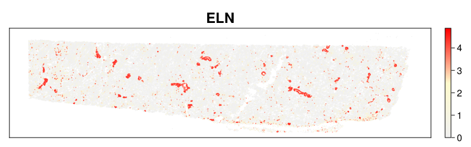
    


```julia
cs.sp_feature_plot(kidney, ["THEMIS"]; 
    use_imputed=true, 
    color_keys = ["gray94", "lemonchiffon", "red"], width=800, height=250)
```


    
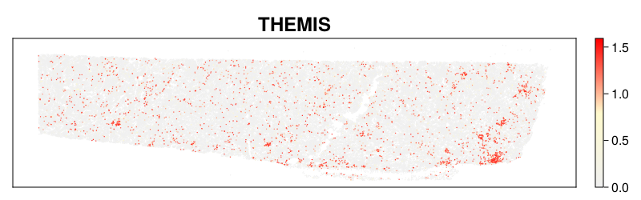
    


```julia
cs.sp_feature_plot(kidney, ["SLC12A3"]; 
    use_imputed=true, 
    color_keys = ["gray94", "lemonchiffon", "red"], width=800, height=250)
```


    
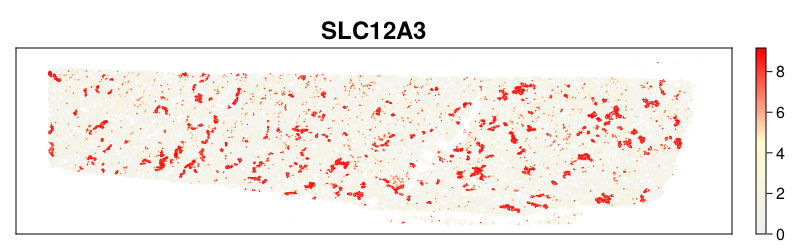
    


```julia
cs.dot_plot(kidney, ["AQP2","UMOD", "SLC22A8","ACTA2","PECAM1","PTPRC","KIT","TMEM52B","CCL5","PDGFRB","PTGDS"], "cluster";
               count_type="norm",height=300, width=200,  expr_cutoff = 1)
```


    
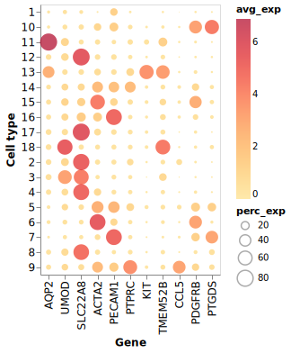
    


```julia
ids=string.(collect(1:18))
celltype = ["vEC", "PT","PT","PT","Fib", "SMC", "gEC","PT","Immune","Pod","PC","PT","IC","Fib","Fib","vEC","PT","TAL" ]
cell_map=Dict(ids .=> celltype)
kidney.metaData = cs.map_values(kidney.metaData, "cluster", "celltype", collect(keys(cell_map)),  collect(values(cell_map)))
kidney.spmetaData.cell = cs.map_values(kidney.spmetaData.cell, "cluster", "celltype", collect(keys(cell_map)),  collect(values(cell_map)));
```


```julia
celltype = unique(kidney.metaData.celltype)
colors = ["slategray1", "orange","blue","magenta","dodgerblue","mediumpurple1", "yellow", "green4", "red","black"]
["#cbe1fc","#f2ab05","#0000f5","#ea33f7", "#458ff7","#a584f7","#ffff54","#3c8925", "#ea3423","#000000"]
anno_color = Dict(celltype .=> colors)
cs.sp_dim_plot(kidney, "celltype"; anno_color = anno_color,
    do_label = false,marker_size = 4, 
    canvas_size = (1500, 600), do_legend=true
    )
```


    
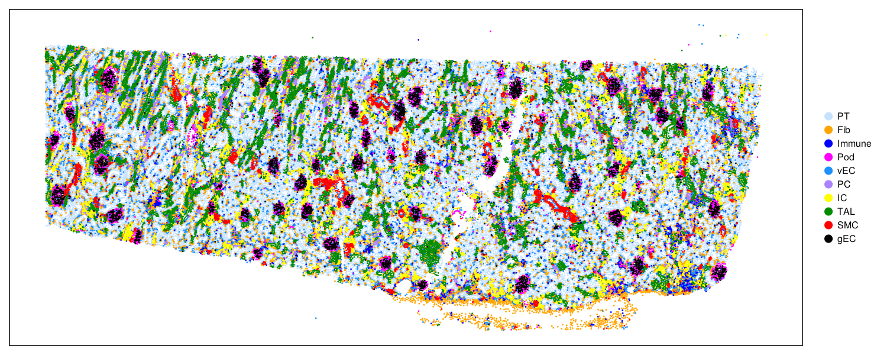
    


```julia
cs.plot_fov(kidney, 20, 5; width=4000, height=1000, group_label="celltype", cell_highlight="Pod", shield=false)
```


    

    


```julia
kidney.spmetaData.polygon.celltype = kidney.spmetaData.cell.celltype;
```


```julia
s3 = cs.subset_fov(kidney, [43, 44, 48, 49],20,5)
x1 = minimum(s3.x)
x2 = maximum(s3.x)
y1 = minimum(s3.y)
y2 = maximum(s3.y)
colors2 = map(x -> (x, 0.7), colors)
cs.plot_cell_polygons(kidney, "celltype"; x_lims = (x1, x2),
    y_lims = (y1, y2), stroke_color="black", cell_colors=colors2,
    width = 600, height = 600, stroke_width=0.5, do_legend=false)
```


    
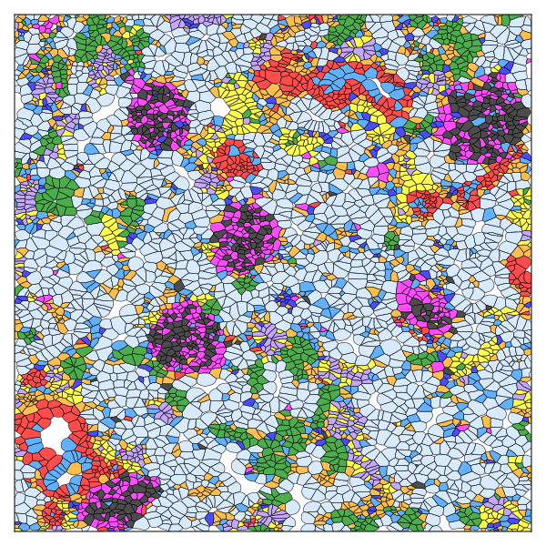
    


```julia
kidney.spmetaData.molecule = cs.map_values(kidney.spmetaData.molecule, "cell", "celltype", kidney.spmetaData.cell.cell, kidney.spmetaData.cell.celltype);
```


```julia
anno_color2 = cs.add_alpha_color_dict(anno_color, 0.08)
cs.plot_transcript_polygons(kidney; gene_list=["UMOD","AQP2","PTGDS"], x_lims = (x1, x2),
    y_lims = (y1, y2), canvas_size=(600, 600), gene_colors=["#d1362b", "#4a7db3", "#67ad57"], 
    anno="celltype", ann_colors=anno_color2, stroke_width=0.2, marker_size=3)
```


    
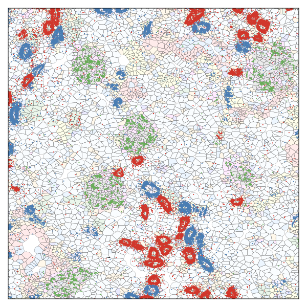
    


```julia
cs.sp_feature_plot(kidney, ["PTGDS"]; 
    use_imputed=false, width=600, height=600,
    x_lims = (x1, x2), y_lims = (y1, y2), marker_size=10,
    color_keys = ["gray94", "lemonchiffon", "red"])
```


    
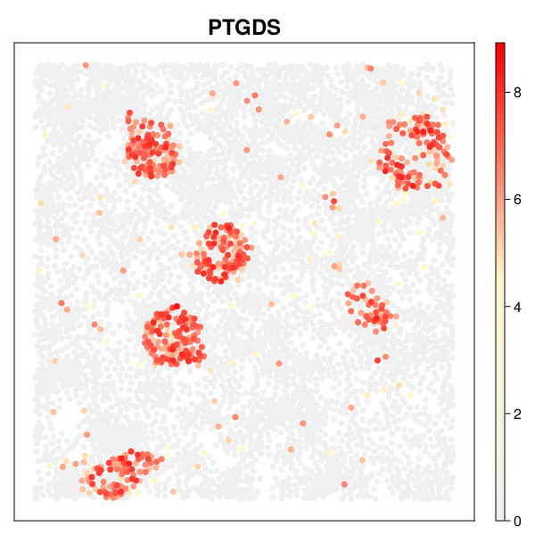
    


```julia
cs.sp_dim_plot(kidney, "celltype"; anno_color = anno_color,
    do_label = false,marker_size = 10, x_lims = (x1, x2),
    y_lims = (y1, y2),
    canvas_size = (700, 600), do_legend=true
    )
```


    
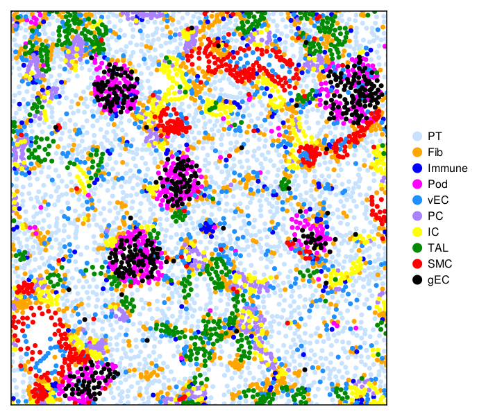
    


```julia
cs.plot_gene_polygons(kidney, ["PTGDS"]; x_lims = (x1, x2),y_lims = (y1, y2),
    width = 600, height = 600, color_keys=["gray98", "lemonchiffon","pink", "red"], 
    bg_color="white", stroke_width=0.15, stroke_color="black")
```


    
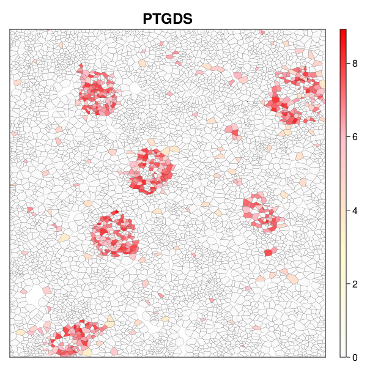
    


```julia
cs.sp_feature_plot(kidney, ["NPHS2"]; 
    use_imputed=true, marker_size = 10, x_lims = (x1, x2),y_lims = (y1, y2),
    color_keys = ["gray94", "lemonchiffon", "red"], width=600, height=600)
```


    
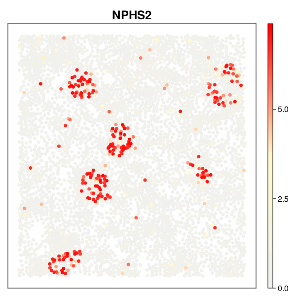
    


```julia

```
