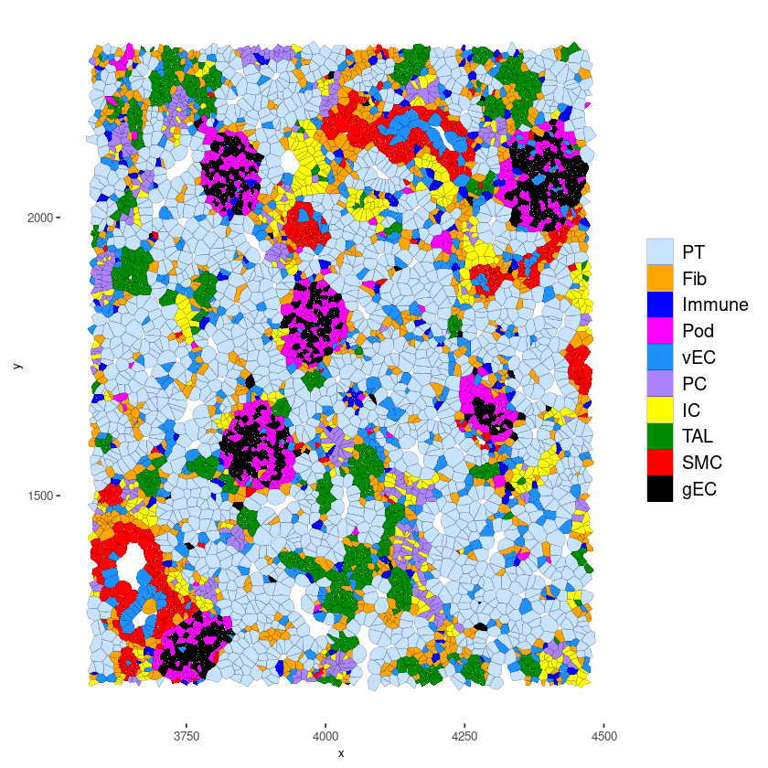
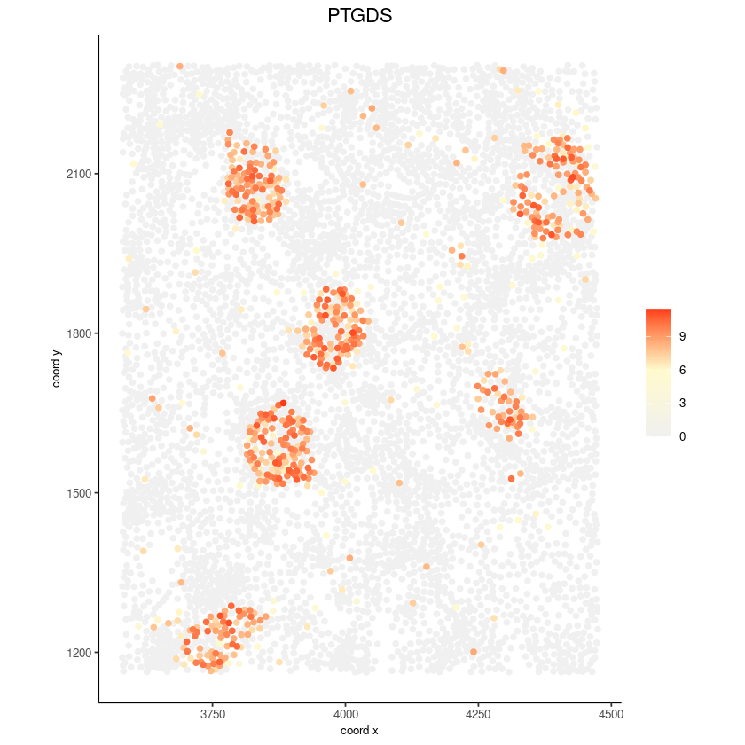

# Analyze a human kidney xenium dataset with Giotto

This markdown document outlines the steps for analyzing a human kidney xenium dataset using Giotto. The dataset can be downloaded from the 10x Genomics website at the following link: https://www.10xgenomics.com/resources/datasets/human-kidney-preview-data-xenium-human-multi-tissue-and-cancer-panel-1-standard


```R
library(Giotto)
genv_exists = checkGiottoEnvironment()
if(!genv_exists){
  installGiottoEnvironment()
}
```

    
     giotto environment found at 
    /home/haojiawu/.local/share/r-miniconda/envs/giotto_env/bin/python
    
    


```R
xenium_folder = '/home/haojiawu/NC_revision/human_kidney_xenium/'
settings_path = paste0(xenium_folder, 'experiment.xenium')
he_img_path = paste0(xenium_folder, 'morphology.ome.tif')

cell_bound_path = paste0(xenium_folder, 'cell_boundaries.csv.gz')
nuc_bound_path = paste0(xenium_folder, 'nucleus_boundaries.csv.gz')
tx_path = paste0(xenium_folder, 'transcripts.csv.gz')
feat_meta_path = paste0(xenium_folder, 'cell_feature_matrix/features.tsv.gz')

expr_mat_path = paste0(xenium_folder, 'cell_feature_matrix')
cell_meta_path = paste0(xenium_folder, 'cells.csv.gz')
meta <- read.csv("kidney_xenium_meta.csv")
cellid <- meta$Cell_id
cellid <- gsub("kidney_", "", cellid)

```


```R
feature_dt = data.table::fread(feat_meta_path, header = FALSE)
colnames(feature_dt) = c('ensembl_ID','feat_name','feat_type')
feature_dt[, table(feat_type)]
feat_types = names(feature_dt[, table(feat_type)])
feat_types_IDs = lapply(
  feat_types, function(type) feature_dt[feat_type == type, unique(feat_name)]
)
names(feat_types_IDs) = feat_types
```


    feat_type
              Gene Expression Negative Control Codeword    Negative Control Probe 
                          377                        41                        20 
          Unassigned Codeword 
                          103 


```R
tx_dt = data.table::fread(tx_path)
data.table::setnames(x = tx_dt,
                     old = c('feature_name', 'x_location', 'y_location'),
                     new = c('feat_ID', 'x', 'y'))
cat('Transcripts info available:\n ', paste0('"', colnames(tx_dt), '"'), '\n',
'with', tx_dt[,.N], 'unfiltered detections\n')
tx_dt_filtered = tx_dt[qv >= 20]
cat('and', tx_dt_filtered[,.N], 'filtered detections\n\n')
tx_dt_types = lapply(
  feat_types_IDs, function(types) tx_dt_filtered[feat_ID %in% types]
)

invisible(lapply(seq_along(tx_dt_types), function(x) {
  cat(names(tx_dt_types)[[x]], 'detections: ', tx_dt_types[[x]][,.N], '\n')
}))
```

    Transcripts info available:
      "transcript_id" "cell_id" "overlaps_nucleus" "feat_ID" "x" "y" "z_location" "qv" "fov_name" "nucleus_distance" 
     with 8090108 unfiltered detections
    and 6724044 filtered detections
    
    Gene Expression detections:  6721196 
    Negative Control Codeword detections:  200 
    Negative Control Probe detections:  637 
    Unassigned Codeword detections:  2011 


```R
gpoints_list = lapply(
  tx_dt_types, function(x) createGiottoPoints(x = x)
) 
```

      Selecting col "feat_ID" as feat_ID column
    
      Selecting cols "x" and "y" as x and y respectively
    
      Selecting col "feat_ID" as feat_ID column
    
      Selecting cols "x" and "y" as x and y respectively
    
      Selecting col "feat_ID" as feat_ID column
    
      Selecting cols "x" and "y" as x and y respectively
    
      Selecting col "feat_ID" as feat_ID column
    
      Selecting cols "x" and "y" as x and y respectively
    


```R
cellPoly_dt = data.table::fread(cell_bound_path)
nucPoly_dt = data.table::fread(nuc_bound_path)

data.table::setnames(cellPoly_dt,
                     old = c('cell_id', 'vertex_x', 'vertex_y'),
                     new = c('poly_ID', 'x', 'y'))
data.table::setnames(nucPoly_dt,
                     old = c('cell_id', 'vertex_x', 'vertex_y'),
                     new = c('poly_ID', 'x', 'y'))

gpoly_cells = createGiottoPolygonsFromDfr(segmdfr = cellPoly_dt,
                                          name = 'cell',
                                          calc_centroids = TRUE)
gpoly_nucs = createGiottoPolygonsFromDfr(segmdfr = nucPoly_dt,
                                         name = 'nucleus',
                                         calc_centroids = TRUE)
```

      Selecting col "poly_ID" as poly_ID column
    
      Selecting cols "x" and "y" as x and y respectively
    
      Selecting col "poly_ID" as poly_ID column
    
      Selecting cols "x" and "y" as x and y respectively
    


```R
dir.create("results")
```

    Warning message in dir.create("results"):
    “'results' already exists”


```R
results_folder = 'results/'
instrs = createGiottoInstructions(save_dir = results_folder,
                                  save_plot = TRUE,
                                  show_plot = FALSE,
                                  return_plot = FALSE)
```

    
    no external python path was provided, but a giotto python environment was found
     and will be used
    


```R
xenium_gobj = createGiottoObjectSubcellular(
  gpoints = list(rna = gpoints_list$`Gene Expression`),
  gpolygons = list(cell = gpoly_cells,
                   nucleus = gpoly_nucs),
  instructions = instrs
)
```

    polygonlist is a list with names
    
    [ cell ] Process polygon info...
    
    [ nucleus ] Process polygon info...
    
    pointslist is a named list
    
    [ rna ] Process point info...
    


```R
#save(xenium_gobj, file="xenium_giotto.Rda")
```


```R
#load("xenium_giotto.Rda")
```


```R
spatPlot2D(xenium_gobj,
           spat_unit = 'cell',
           point_shape = 'no_border',
           point_size = 0.5,
           point_alpha = 0.4,
           save_param = list(
             base_width = 7,
             base_height = 7,
             save_name = '1_spatplot'))
```


```R
xenium_gobj = calculateOverlapRaster(xenium_gobj,
                                     spatial_info = 'cell',
                                     feat_info = 'rna')
```

    1. convert polygon to raster 
    2. overlap raster and points 
    3. add polygon information 
    4. add points information 
    5. create overlap polygon information 


```R
xenium_gobj = overlapToMatrix(xenium_gobj,
                              poly_info = 'cell',
                              feat_info = 'rna',
                              name = 'raw')

showGiottoExpression(xenium_gobj)
```

    └──Spatial unit "cell"
       └──Feature type "rna"
          └──Expression data "raw" values:
                An object of class exprObj : "raw"
                spat_unit : "cell"
                feat_type : "rna"
                provenance: cell 
                
                contains:
                377 x 97560 sparse Matrix of class "dgCMatrix"
                                                      
                RIDA  7 1 1 1 1 1 . 3 . . . . 1 ......
                MCF2L . 3 . 3 . . . 1 . . 1 . . ......
                MMRN2 . . . . . . . . . . . . . ......
                
                 ........suppressing 97547 columns and 371 rows 
                                                     
                RETN . . . . . . . . . . . . . ......
                CD70 . . . . . . . . . . . . . ......
                INS  . . . . . . . . . . . . . ......
                
                 First four colnames:
                 aaabbkjn-1 aaabgihg-1 aaabmoge-1
                 aaabneib-1 
             


```R
panel_meta_path = paste0(xenium_folder, 'features.tsv')

panel_meta = data.table::fread(panel_meta_path, header = F)

```


```R
data.table::setnames(panel_meta,'V2', 'feat_ID')

```


```R
data.table::setnames(panel_meta,'V1', 'gene_name')
data.table::setnames(panel_meta,'V3', 'Type')

```


```R

xenium_gobj = addFeatMetadata(gobject = xenium_gobj,
                              feat_type = 'rna',
                              spat_unit = 'cell',
                              new_metadata = panel_meta,
                              by_column = TRUE,
                              column_feat_ID = 'feat_ID')

```


```R
xenium_gobj <- subsetGiotto(xenium_gobj, cell_ids=cellid)
```


```R
xenium_gobj@cell_metadata$cell$rna@metaDT$celltype <- meta$celltype
```


```R
xenium_gobj = filterGiotto(gobject = xenium_gobj,
                           feat_det_in_min_cells = 3,
                           min_det_feats_per_cell = 1,
                           spat_unit = 'cell',
                           poly_info = 'cell',
                           expression_threshold = 1)
```

    completed 1: preparation 
    completed 2: subset expression data 
    completed 3: subset spatial locations 
    completed 4: subset cell (spatial units) and feature IDs 
    completed 5: subset cell metadata 
    completed 6: subset feature metadata 
    completed 7: subset spatial network(s) 
    completed 8: subsetted dimension reductions 
    completed 9: subsetted nearest network(s) 
    completed 10: subsetted spatial enrichment results 
    for  cell 
    -->  cell  found back in polygon layer:  cell 
    for  nucleus 
    completed 11: subsetted spatial information data 
    [1] "rna"
    completed 12: subsetted spatial feature data 
    
    Feature type:  rna 
    Number of cells removed:  20  out of  97511 
    Number of feats removed:  0  out of  377 


```R
xenium_gobj = addStatistics(xenium_gobj, expression_values = 'raw')
```


```R
xenium_gobj = normalizeGiotto(gobject = xenium_gobj,
                              spat_unit = 'cell',
                              scalefactor = 5000,
                              verbose = T)
```

    
    first scale feats and then cells
    


```R
xenium_gobj = calculateHVF(gobject = xenium_gobj,
                           spat_unit = 'cell',
                           save_param = list(
                             save_name = '2_HVF'))
```


```R
xenium_gobj = runPCA(gobject = xenium_gobj,
                     spat_unit = 'cell',
                     expression_values = 'scaled',
                     feats_to_use = NULL,
                     scale_unit = F,
                     center = F)

screePlot(xenium_gobj,
          ncp = 20,
          save_param = list(
            save_name = '3a_screePlot'))
showGiottoDimRed(xenium_gobj)
plotPCA(xenium_gobj,
        spat_unit = 'cell',
        dim_reduction_name = 'pca',
        dim1_to_use = 1,
        dim2_to_use = 2)
```

    [1] "finished runPCA_factominer, method == factominer"
    PCA with name:  pca  already exists and will be used for the screeplot 
    Dim reduction on cells:
     ------------------------- 
    
    .
    └──Spatial unit "cell"
       └──Feature type "rna"
          └──Dim reduction type "pca"
             └──S4 dimObj "pca" coordinates:   (97491 rows 100 cols)
                                  Dim.1        Dim.2
                   aaabbkjn-1  8.190088  0.647853814
                   aaabgihg-1  6.281486 -0.003022965
                   aaabmoge-1 -1.696760 -2.892193938
                


```R
xenium_gobj = runUMAP(xenium_gobj,
                      dimensions_to_use = 1:10,
                      spat_unit = 'cell')
```


```R
plotUMAP(xenium_gobj,
         point_size = 0.01,
         save_param = list(
           save_name = '4b_UMAP'))
```


```R
xenium_gobj = createNearestNetwork(xenium_gobj,
                                   dimensions_to_use = 1:10,
                                   k = 10,
                                   spat_unit = 'cell')
xenium_gobj = doLeidenCluster(xenium_gobj,
                              resolution = 0.25,
                              n_iterations = 100,
                              spat_unit = 'cell')

plotUMAP(gobject = xenium_gobj,
         spat_unit = 'cell',
         cell_color = 'leiden_clus',
         show_legend = FALSE,
         point_size = 0.01,
         point_shape = 'no_border',
         show_plot = T,
         save_param = list(save_name = '5_umap_leiden'))
```


```R
cell_order <- c("PT","Fib","Immune","Pod","vEC","PC","IC","TAL","SMC","gEC")
xenium_gobj@cell_metadata$cell$rna@metaDT$celltype <- factor(xenium_gobj@cell_metadata$cell$rna@metaDT$celltype, levels=cell_order)
```


```R
colors = c("slategray1", "orange","blue","magenta","dodgerblue","mediumpurple1", "yellow", "green4", "red","black")
plotUMAP(gobject = xenium_gobj,
         spat_unit = 'cell',
         cell_color = 'celltype',
         show_legend = T,
         legend_symbol_size=6,
         legend_text=16,
         point_size = 0.01,
        show_plot = T,
         cell_color_code=colors,
         point_shape = 'no_border',
         save_param = list(save_name = '6_umap_celltype', base_width=6, base_height=6, dpi=300))
```


    

    


```R
spatInSituPlotPoints(xenium_gobj,
                     show_image = FALSE,
                     feats = NULL,
                     point_size = 0.05,
                     show_polygon = TRUE,
                     polygon_feat_type = 'cell',
                     polygon_alpha = 1,
                     polygon_color = 'black',
                     polygon_line_size = 0.01,
                     polygon_fill = 'celltype',
                     polygon_fill_as_factor = TRUE,
                     coord_fix_ratio = TRUE,
                    background_color = "white",
                    show_plot = T,
                    polygon_fill_code = colors,
                     save_para = list(
                       save_name = '7_polys'))
```

    Warning message in spatInSituPlotPoints(xenium_gobj, show_image = FALSE, feats = NULL, :
    “You need to select features (feats) and modify feature types (feat_type) if you want to show individual features (e.g. transcripts) 
    ”
    plot polygon layer done
    


    

    


```R
xenium_gobj_subset = subsetGiottoLocs(xenium_gobj,
                                      y_max = 2304.39,
                                      y_min = 1162.36,
                                      x_max = 4474.28,
                                      x_min = 3580.04)
```


```R
spatInSituPlotPoints(xenium_gobj_subset,
                     show_image = F,
                     feats = NULL,
                     point_size = 0.05,
                     show_polygon = T,
                     polygon_feat_type = 'cell',
                     polygon_alpha = 1,
                     polygon_color = 'black',
                     polygon_line_size = 0.05,
                     polygon_fill = 'celltype',
                     polygon_fill_as_factor = TRUE,
                    background_color = "white",
                     coord_fix_ratio = TRUE,
                     polygon_fill_code = colors,
                     legend_text = 12,
                     show_plot = T,
                     save_para = list(
                       save_name = '8_polys_sub2',
                         base_width=7, 
                         base_height=6, dpi=300))
```

    Warning message in spatInSituPlotPoints(xenium_gobj_subset, show_image = F, feats = NULL, :
    “You need to select features (feats) and modify feature types (feat_type) if you want to show individual features (e.g. transcripts) 
    ”
    plot polygon layer done
    


    

    


```R
spatDimPlot2D(xenium_gobj_subset,
                    cell_color_code = colors,
                    cell_color = "celltype",
                        spat_show_center_label = F,
                    plot_alignment = "horizontal",
                    show_plot = T,
                     save_para = list(
                       save_name = '8_polys_sub2',
                         base_width=7, 
                         base_height=6, dpi=300))
```


    

    


```R
spatFeatPlot2D(xenium_gobj_subset,
                    feats = 'PTGDS',
                   cell_color_gradient = c("gray94","lemonchiffon1", "red"),
               gradient_midpoint = 6,
               point_size=1.5,
                show_plot = T,
               point_shape="no_border",
                     save_para = list(
                       save_name = '9_polys_sub2',
                         base_width=7, 
                         base_height=6, dpi=300))
```


    

    


```R
options(repr.plot.width = 8, repr.plot.height = 6, repr.plot.res = 300)
spatInSituPlotPoints(xenium_gobj_subset,
                     show_image = F,
                     feats = list('rna' = c(
                       "UMOD", "AQP2", "PTGDS")),
                    feats_color_code = c(
                       "UMOD" = "#d1362b",
                       'AQP2' = "#4a7db3",
                       'PTGDS' = '#67ad57'),
                     point_size = 0.3,
                     show_polygon = T,
                     polygon_feat_type = 'cell',
                     polygon_alpha = 0.08,
                     polygon_color = 'black',
                     polygon_line_size = 0.05,
                     polygon_fill = 'celltype',
                     polygon_fill_as_factor = TRUE,
                    background_color = "white",
                     coord_fix_ratio = TRUE,
                     polygon_fill_code = colors,
                     legend_text = 12,
                     show_plot = T,
                     save_para = list(
                       save_name = '10_polys_sub2',
                         base_width=7, 
                         base_height=6, dpi=300))
```

    --| Plotting 21701 feature points
    
    plot feature points layer done
    
    plot polygon layer done
    


    

    


```R
save.image(file="human_xenium_giotto.Rda")
```


```R

```


```R

```
