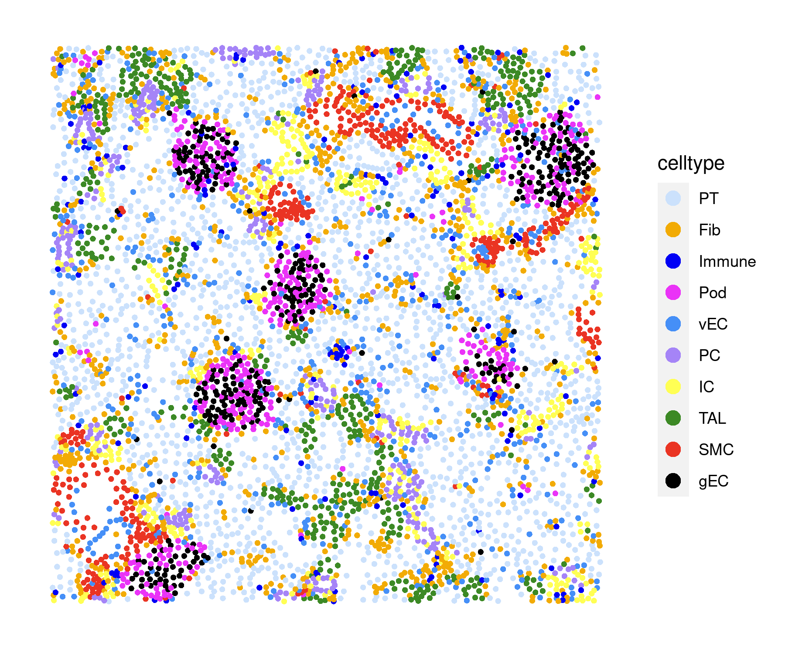

# Analyze a human kidney xenium dataset with Seurat V5


```R
library(Seurat)
options(Seurat.object.assay.version = "v5")
#library(future)
#plan("multisession", workers = 10)
library(ggplot2)
```

    Loading required package: SeuratObject
    
    Loading required package: sp
    
    The legacy packages maptools, rgdal, and rgeos, underpinning the sp package,
    which was just loaded, will retire in October 2023.
    Please refer to R-spatial evolution reports for details, especially
    https://r-spatial.org/r/2023/05/15/evolution4.html.
    It may be desirable to make the sf package available;
    package maintainers should consider adding sf to Suggests:.
    The sp package is now running under evolution status 2
         (status 2 uses the sf package in place of rgdal)
    
    
    Attaching package: ‘SeuratObject’
    
    
    The following objects are masked from ‘package:base’:
    
        intersect, saveRDS
    
    
    Loading Seurat v5 beta version 
    To maintain compatibility with previous workflows, new Seurat objects will use the previous object structure by default
    To use new Seurat v5 assays: Please run: options(Seurat.object.assay.version = 'v5')
    


```R
path <- "/home/haojiawu/NC_revision/human_kidney_xenium/"
xenium.obj <- LoadXenium(path, fov = "fov")
xenium.obj <- subset(xenium.obj, subset = nCount_Xenium > 0)
```

    10X data contains more than one type and is being returned as a list containing matrices of each type.
    
    Warning message:
    “Feature names cannot have underscores ('_'), replacing with dashes ('-')”
    Warning message:
    “Feature names cannot have underscores ('_'), replacing with dashes ('-')”
    Warning message:
    “Feature names cannot have underscores ('_'), replacing with dashes ('-')”
    Warning message:
    “Feature names cannot have underscores ('_'), replacing with dashes ('-')”
    Warning message:
    “Feature names cannot have underscores ('_'), replacing with dashes ('-')”
    Warning message:
    “Feature names cannot have underscores ('_'), replacing with dashes ('-')”
    Warning message:
    “Not validating FOV objects”
    Warning message:
    “Not validating Centroids objects”
    Warning message:
    “Not validating Centroids objects”
    Warning message:
    “Not validating FOV objects”
    Warning message:
    “Not validating Centroids objects”
    Warning message:
    “Not validating FOV objects”
    Warning message:
    “Not validating FOV objects”
    Warning message:
    “Not validating FOV objects”
    Warning message:
    “Not validating Seurat objects”


```R
xenium.obj <- SCTransform(xenium.obj, assay = "Xenium")
xenium.obj <- RunPCA(xenium.obj, npcs = 30, features = rownames(xenium.obj))
xenium.obj <- RunUMAP(xenium.obj, dims = 1:30)
xenium.obj <- FindNeighbors(xenium.obj, reduction = "pca", dims = 1:30)
xenium.obj <- FindClusters(xenium.obj, resolution = 0.3)
```

    Running SCTransform on assay: Xenium
    
    vst.flavor='v2' set, setting model to use fixed slope and exclude poisson genes.
    
    Calculating cell attributes from input UMI matrix: log_umi
    
    Total Step 1 genes: 369
    
    Total overdispersed genes: 367
    
    Excluding 2 genes from Step 1 because they are not overdispersed.
    
    Variance stabilizing transformation of count matrix of size 377 by 97511
    
    Model formula is y ~ log_umi
    
    Get Negative Binomial regression parameters per gene
    
    Using 367 genes, 5000 cells
    


      |======================================================================| 100%


    Setting estimate of  31 genes to inf as theta_mm/theta_mle < 1e-3
    
    # of step1 poisson genes (variance < mean): 0
    
    # of low mean genes (mean < 0.001): 6
    
    Total # of Step1 poisson genes (theta=Inf; variance < mean): 32
    
    Total # of poisson genes (theta=Inf; variance < mean): 9
    
    Calling offset model for all 9 poisson genes
    
    Found 31 outliers - those will be ignored in fitting/regularization step
    
    
    Ignoring theta inf genes
    
    Replacing fit params for 9 poisson genes by theta=Inf
    
    Setting min_variance based on median UMI:  0.04
    
    Second step: Get residuals using fitted parameters for 377 genes
    


      |======================================================================| 100%


    Computing corrected count matrix for 377 genes
    


      |======================================================================| 100%


    Calculating gene attributes
    
    Wall clock passed: Time difference of 18.9623 secs
    
    Determine variable features
    
    Centering data matrix
    
    Place corrected count matrix in counts slot
    
    Set default assay to SCT
    
    PC_ 1 
    Positive:  UMOD, KNG1, TMEM52B, PPP1R1A, FXYD2, CDH16, PVALB, PROX1, MEST, EHF 
    	   KRT7, LPL, ARFGEF3, PPP1R1B, LTBP2, IL1R2, ERBB2, EPCAM, GPC3, BCL2L11 
    	   PCP4, PLIN4, DIRAS3, TCIM, MET, GPC1, MLPH, AMY2A, CA4, SNCG 
    Negative:  MYH11, GATM, ACTA2, PTGDS, SMIM24, AIF1, SLC22A8, NAT8, CD34, PECAM1 
    	   ANPEP, PDGFRB, C7, CAVIN1, IL1RL1, EGFL7, AQP2, DPEP1, GLYATL1, INMT 
    	   RERGL, SLC4A1, FBLN1, MPEG1, CNN1, CD93, MS4A6A, PTN, ADAMTS1, TNC 
    PC_ 2 
    Positive:  AQP2, STC1, SLC4A1, AQP3, HMGCS2, EPCAM, CDH16, ELF5, FOXI1, GATA2 
    	   PLCG2, HEPACAM2, EHF, KIT, FGL2, FXYD2, TMEM52B, ERBB2, GDF15, KRT7 
    	   MEST, ADH1C, SEMA3C, SMIM24, RAPGEF3, PPARG, PVALB, CLIC6, CFTR, MET 
    Negative:  MYH11, ACTA2, PTGDS, UMOD, PDGFRB, AIF1, CD34, MYLK, CAVIN1, PECAM1 
    	   RERGL, C7, IL1RL1, CNN1, EGFL7, TCIM, FBLN1, PTN, INMT, CD93 
    	   TNC, PDGFRA, MPEG1, ADAMTS1, MS4A6A, MEF2C, ADGRL4, CD14, FHL2, SFRP2 
    PC_ 3 
    Positive:  GATM, NAT8, SMIM24, SLC22A8, ANPEP, GLYATL1, DPEP1, RIDA, RBP5, THY1 
    	   BBOX1, ACE2, TMEM174, S100A1, FXYD2, HAVCR2, CYP2B6, TFPI, PCP4, MCF2L 
    	   STC2, CFB, CA4, TENT5C, COCH, GPC3, MET, CD83, MTRNR2L11, CD68 
    Negative:  MYH11, AQP2, ACTA2, STC1, PTGDS, SLC4A1, HMGCS2, RERGL, AQP3, PDGFRB 
    	   CAVIN1, CNN1, AIF1, CD34, ELF5, MYLK, FGL2, IL1RL1, UMOD, GATA2 
    	   C7, PECAM1, PLCG2, EPCAM, EHF, EDNRB, FOXI1, PTN, FBLN1, TCIM 
    PC_ 4 
    Positive:  MYH11, RERGL, ACTA2, GATM, CNN1, SMIM24, NAT8, SLC22A8, ANPEP, GLYATL1 
    	   AQP2, DPEP1, RIDA, KCNMA1, THY1, CAV1, RBP5, BBOX1, ACE2, DES 
    	   TMEM174, FXYD2, MYLK, S100A1, ANGPT2, CDH16, STC1, CYP2B6, EPCAM, AQP3 
    Negative:  PTGDS, AIF1, IL1RL1, PECAM1, CD34, TCIM, EGFL7, GPRC5A, INMT, SNCA 
    	   BTNL9, PDPN, MPEG1, TRAC, GNG11, NPDC1, RAMP2, MS4A6A, ADGRL4, PTPRC 
    	   SERPINB9, SH2D3C, CRHBP, C7, CAVIN2, CLEC14A, CD93, ECSCR, TBX3, TM4SF18 
    PC_ 5 
    Positive:  AQP2, STC1, AQP3, UMOD, GATM, PTGDS, ELF5, HMGCS2, NAT8, SLC22A8 
    	   ANPEP, AIF1, FGL2, IL1RL1, GLYATL1, CD34, RAPGEF3, MEST, RBP5, DPEP1 
    	   EHF, THY1, RIDA, PECAM1, BBOX1, ADH1C, S100A1, EGFL7, GNG11, SMIM24 
    Negative:  SLC4A1, KIT, TMEM52B, FOXI1, FXYD2, HEPACAM2, KNG1, PLCG2, SEMA3C, CDH16 
    	   PVALB, CFTR, EPCAM, CSF2RA, CD83, PROX1, ALDH1A3, MET, LTBP2, CYTIP 
    	   ERBB2, GEM, PTPRC, KRT7, LPL, IL1R2, ACTG2, C7, PCNA, CPA3 
    
    Warning message:
    “The default method for RunUMAP has changed from calling Python UMAP via reticulate to the R-native UWOT using the cosine metric
    To use Python UMAP via reticulate, set umap.method to 'umap-learn' and metric to 'correlation'
    This message will be shown once per session”
    13:17:56 UMAP embedding parameters a = 0.9922 b = 1.112
    
    Found more than one class "dist" in cache; using the first, from namespace 'spam'
    
    Also defined by ‘BiocGenerics’
    
    13:17:56 Read 97511 rows and found 30 numeric columns
    
    13:17:56 Using Annoy for neighbor search, n_neighbors = 30
    
    Found more than one class "dist" in cache; using the first, from namespace 'spam'
    
    Also defined by ‘BiocGenerics’
    
    13:17:56 Building Annoy index with metric = cosine, n_trees = 50
    
    0%   10   20   30   40   50   60   70   80   90   100%
    
    [----|----|----|----|----|----|----|----|----|----|
    
    *
    *
    *
    *
    *
    *
    *
    *
    *
    *
    *
    *
    *
    *
    *
    *
    *
    *
    *
    *
    *
    *
    *
    *
    *
    *
    *
    *
    *
    *
    *
    *
    *
    *
    *
    *
    *
    *
    *
    *
    *
    *
    *
    *
    *
    *
    *
    *
    *
    *
    |
    
    13:18:31 Writing NN index file to temp file /tmp/Rtmp5nZCi2/file3aa5dc34e6aa
    
    13:18:31 Searching Annoy index using 1 thread, search_k = 3000
    
    13:19:18 Annoy recall = 97.33%
    
    13:19:19 Commencing smooth kNN distance calibration using 1 thread
     with target n_neighbors = 30
    
    13:19:20 14 smooth knn distance failures
    
    13:19:26 Initializing from normalized Laplacian + noise (using RSpectra)
    
    13:19:36 Commencing optimization for 200 epochs, with 4771158 positive edges
    
    13:20:47 Optimization finished
    
    Computing nearest neighbor graph
    
    Computing SNN
    


    Modularity Optimizer version 1.3.0 by Ludo Waltman and Nees Jan van Eck
    
    Number of nodes: 97511
    Number of edges: 3970495
    
    Running Louvain algorithm...
    Maximum modularity in 10 random starts: 0.9378
    Number of communities: 19
    Elapsed time: 46 seconds


```R
xenium.obj <- RunUMAP(xenium.obj, dims = 1:10)
xenium.obj <- FindNeighbors(xenium.obj, reduction = "pca", dims = 1:10)
xenium.obj <- FindClusters(xenium.obj, resolution = 0.3)
```

    13:22:16 UMAP embedding parameters a = 0.9922 b = 1.112
    
    Found more than one class "dist" in cache; using the first, from namespace 'spam'
    
    Also defined by ‘BiocGenerics’
    
    13:22:16 Read 97511 rows and found 10 numeric columns
    
    13:22:16 Using Annoy for neighbor search, n_neighbors = 30
    
    Found more than one class "dist" in cache; using the first, from namespace 'spam'
    
    Also defined by ‘BiocGenerics’
    
    13:22:16 Building Annoy index with metric = cosine, n_trees = 50
    
    0%   10   20   30   40   50   60   70   80   90   100%
    
    [----|----|----|----|----|----|----|----|----|----|
    
    *
    *
    *
    *
    *
    *
    *
    *
    *
    *
    *
    *
    *
    *
    *
    *
    *
    *
    *
    *
    *
    *
    *
    *
    *
    *
    *
    *
    *
    *
    *
    *
    *
    *
    *
    *
    *
    *
    *
    *
    *
    *
    *
    *
    *
    *
    *
    *
    *
    *
    |
    
    13:22:34 Writing NN index file to temp file /tmp/Rtmp5nZCi2/file3aa5d672d506f
    
    13:22:35 Searching Annoy index using 1 thread, search_k = 3000
    
    13:23:31 Annoy recall = 100%
    
    13:23:33 Commencing smooth kNN distance calibration using 1 thread
     with target n_neighbors = 30
    
    13:23:35 15 smooth knn distance failures
    
    13:23:40 Initializing from normalized Laplacian + noise (using RSpectra)
    
    13:23:54 Commencing optimization for 200 epochs, with 4213628 positive edges
    
    13:24:53 Optimization finished
    
    Computing nearest neighbor graph
    
    Computing SNN
    


    Modularity Optimizer version 1.3.0 by Ludo Waltman and Nees Jan van Eck
    
    Number of nodes: 97511
    Number of edges: 3072021
    
    Running Louvain algorithm...
    Maximum modularity in 10 random starts: 0.9400
    Number of communities: 16
    Elapsed time: 43 seconds


```R
meta.data <- read.csv("kidney_xenium_meta.csv")
```


```R
xenium.obj@meta.data$celltype <- meta.data$celltype
```


```R
table(xenium.obj@meta.data$celltype)
```


    
       Fib    gEC     IC Immune     PC    Pod     PT    SMC    TAL    vEC 
     19937   3463   7306   4012   5382   4284  28424   3142  11756   9805 


```R
cell_order <- c("PT","Fib","Immune","Pod","vEC","PC","IC","TAL","SMC","gEC")
xenium.obj@meta.data$celltype <- factor(xenium.obj@meta.data$celltype, 
                                        levels=cell_order)
```


```R
colors = c("slategray1", "orange","blue","magenta","dodgerblue","mediumpurple1", "yellow", "green4", "red","black")
```


```R
xenium.obj <- SetIdent(xenium.obj, value = "celltype")
```


```R
DimPlot(xenium.obj, group.by = "celltype", label=T, label.size = 6) & scale_color_manual(values = colors) & NoAxes() & ggtitle("")
```


    

    


```R
meta<-read.csv("kidney_xenium_meta.csv")
xenium.obj@meta.data$celltype <- meta$celltype
```


```R
library(ggplot2)
library(rgeos)
```

    rgeos version: 0.6-4, (SVN revision 699)
     GEOS runtime version: 3.10.2-CAPI-1.16.0 
     Please note that rgeos will be retired during October 2023,
    plan transition to sf or terra functions using GEOS at your earliest convenience.
    See https://r-spatial.org/r/2023/05/15/evolution4.html for details.
     GEOS using OverlayNG
     Linking to sp version: 2.0-0 
     Polygon checking: TRUE 
    
    


```R
xenium.obj <- SetIdent(xenium.obj, value = "celltype")
```


```R
colors <- c("#cbe1fc","#f2ab05","#0000f5","#ea33f7", "#458ff7","#a584f7","#ffff54","#3c8925", "#ea3423","#000000")
```


```R
cropped.coords <- Crop(xenium.obj[["fov"]], y = c(3580.04, 4474.28), x = c(1162.36, 2304.39), coords = "plot")
xenium.obj[["zoom"]] <- cropped.coords
DefaultBoundary(xenium.obj[["zoom"]]) <- "segmentation"
```

    Warning message:
    “Key ‘Xenium_’ taken, using ‘zoom_’ instead”
    Warning message:
    “Adding image with unordered cells”


```R
ImageDimPlot(xenium.obj, fov = "zoom", axes = TRUE, border.color = "black",alpha =  0.08,border.size = 0.1, cols = colors,dark.background = F,
    coord.fixed = F, molecules = c("UMOD","AQP2","PTGDS"), nmols = 10000) + coord_flip()
```


    

    


```R
options(repr.plot.width = 7, repr.plot.height = 6, repr.plot.res = 300)
ImageDimPlot(xenium.obj, fov = "zoom", axes = T, border.color = "black", alpha = 1 ,
             border.size = 0.1, cols = colors,
             dark.background = F, coord.fixed = F) + coord_flip()
```


    

    


```R
options(repr.plot.width = 6, repr.plot.height = 5, repr.plot.res = 300)
ImageDimPlot(xenium.obj, group.by = "celltype", dark.background = F, cols = colors, size=1.5) + 
 xlim(1162.36, 2304.39) + ylim(3580.04, 4474.28)+ coord_flip()
```

    Warning message:
    “No FOV associated with assay 'SCT', using global default FOV”
    Coordinate system already present. Adding new coordinate system, which will replace the existing one.
    Warning message:
    “Removed 91834 rows containing missing values (`geom_point()`).”


    

    


```R
options(repr.plot.width = 6, repr.plot.height = 5, repr.plot.res = 300)
ImageFeaturePlot(xenium.obj,  fov = "zoom", axes = TRUE,  features = "PTGDS", 
                 size = 1.5, dark.background = F) + coord_flip()+
    theme_void() + theme(plot.title = element_text(hjust=0.5)) + scale_fill_gradientn(colors = c("gray94","orange", "red"))
```

    Coordinate system already present. Adding new coordinate system, which will replace the existing one.
    Scale for fill is already present.
    Adding another scale for fill, which will replace the existing scale.


    

    


```R
library(ggplot2)
options(repr.plot.width = 5, repr.plot.height = 5, repr.plot.res = 300)
ImageFeaturePlot(xenium.obj, axes = TRUE,  features = "PTGDS", 
                 size = 1.8, cols = c("gray94","lemonchiffon1", "red"),dark.background = F)+ 
 xlim(1162.36, 2304.39) + ylim(3580.04, 4474.28) + coord_flip() + theme_void() + theme(plot.title = element_text(hjust=0.5))
```

    Warning message:
    “No FOV associated with assay 'SCT', using global default FOV”
    Coordinate system already present. Adding new coordinate system, which will replace the existing one.
    Warning message:
    “Removed 91834 rows containing missing values (`geom_point()`).”


    

    


```R
sessionInfo()
```


    R version 4.3.1 (2023-06-16)
    Platform: x86_64-pc-linux-gnu (64-bit)
    Running under: Ubuntu 22.04.3 LTS
    
    Matrix products: default
    BLAS:   /usr/lib/x86_64-linux-gnu/blas/libblas.so.3.10.0 
    LAPACK: /usr/lib/x86_64-linux-gnu/lapack/liblapack.so.3.10.0
    
    locale:
     [1] LC_CTYPE=en_US.UTF-8       LC_NUMERIC=C              
     [3] LC_TIME=en_US.UTF-8        LC_COLLATE=en_US.UTF-8    
     [5] LC_MONETARY=en_US.UTF-8    LC_MESSAGES=en_US.UTF-8   
     [7] LC_PAPER=en_US.UTF-8       LC_NAME=C                 
     [9] LC_ADDRESS=C               LC_TELEPHONE=C            
    [11] LC_MEASUREMENT=en_US.UTF-8 LC_IDENTIFICATION=C       
    
    time zone: America/Chicago
    tzcode source: system (glibc)
    
    attached base packages:
    [1] stats     graphics  grDevices utils     datasets  methods   base     
    
    other attached packages:
    [1] ggplot2_3.4.3           Seurat_4.9.9.9060       SeuratObject_4.9.9.9091
    [4] sp_2.0-0               
    
    loaded via a namespace (and not attached):
      [1] deldir_1.0-9           pbapply_1.7-2          gridExtra_2.3         
      [4] rlang_1.1.1            magrittr_2.0.3         RcppAnnoy_0.0.21      
      [7] spatstat.geom_3.2-5    matrixStats_1.0.0      ggridges_0.5.4        
     [10] compiler_4.3.1         png_0.1-8              vctrs_0.6.3           
     [13] reshape2_1.4.4         stringr_1.5.0          pkgconfig_2.0.3       
     [16] crayon_1.5.2           fastmap_1.1.1          ellipsis_0.3.2        
     [19] utf8_1.2.3             promises_1.2.1         purrr_1.0.2           
     [22] jsonlite_1.8.7         goftest_1.2-3          later_1.3.1           
     [25] uuid_1.1-0             spatstat.utils_3.0-3   irlba_2.3.5.1         
     [28] parallel_4.3.1         cluster_2.1.4          R6_2.5.1              
     [31] ica_1.0-3              spatstat.data_3.0-1    stringi_1.7.12        
     [34] RColorBrewer_1.1-3     reticulate_1.31        parallelly_1.36.0     
     [37] lmtest_0.9-40          scattermore_1.2        Rcpp_1.0.11           
     [40] IRkernel_1.3.2         tensor_1.5             future.apply_1.11.0   
     [43] zoo_1.8-12             base64enc_0.1-3        sctransform_0.3.5     
     [46] httpuv_1.6.11          Matrix_1.6-0           splines_4.3.1         
     [49] igraph_1.5.1           tidyselect_1.2.0       abind_1.4-5           
     [52] spatstat.random_3.1-5  codetools_0.2-19       miniUI_0.1.1.1        
     [55] spatstat.explore_3.2-3 listenv_0.9.0          lattice_0.21-8        
     [58] tibble_3.2.1           plyr_1.8.8             withr_2.5.0           
     [61] shiny_1.7.5            ROCR_1.0-11            evaluate_0.21         
     [64] Rtsne_0.16             future_1.33.0          fastDummies_1.7.3     
     [67] survival_3.5-5         polyclip_1.10-4        fitdistrplus_1.1-11   
     [70] pillar_1.9.0           KernSmooth_2.23-22     plotly_4.10.2         
     [73] generics_0.1.3         RcppHNSW_0.4.1         IRdisplay_1.1         
     [76] munsell_0.5.0          scales_1.2.1           globals_0.16.2        
     [79] xtable_1.8-4           glue_1.6.2             lazyeval_0.2.2        
     [82] tools_4.3.1            data.table_1.14.8      RSpectra_0.16-1       
     [85] pbdZMQ_0.3-9           RANN_2.6.1             leiden_0.4.3          
     [88] dotCall64_1.0-2        cowplot_1.1.1          grid_4.3.1            
     [91] tidyr_1.3.0            colorspace_2.1-0       nlme_3.1-162          
     [94] patchwork_1.1.3        repr_1.1.6             cli_3.6.1             
     [97] spatstat.sparse_3.0-2  spam_2.9-1             fansi_1.0.4           
    [100] viridisLite_0.4.2      dplyr_1.1.3            uwot_0.1.16           
    [103] gtable_0.3.4           digest_0.6.33          progressr_0.14.0      
    [106] ggrepel_0.9.3          htmlwidgets_1.6.2      htmltools_0.5.6       
    [109] lifecycle_1.0.3        httr_1.4.7             mime_0.12             
    [112] MASS_7.3-60           


```R

```
