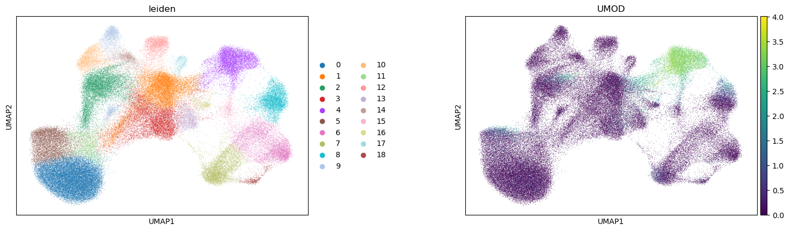
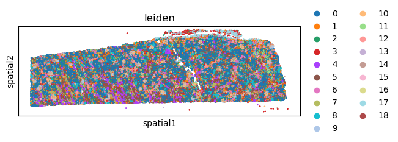
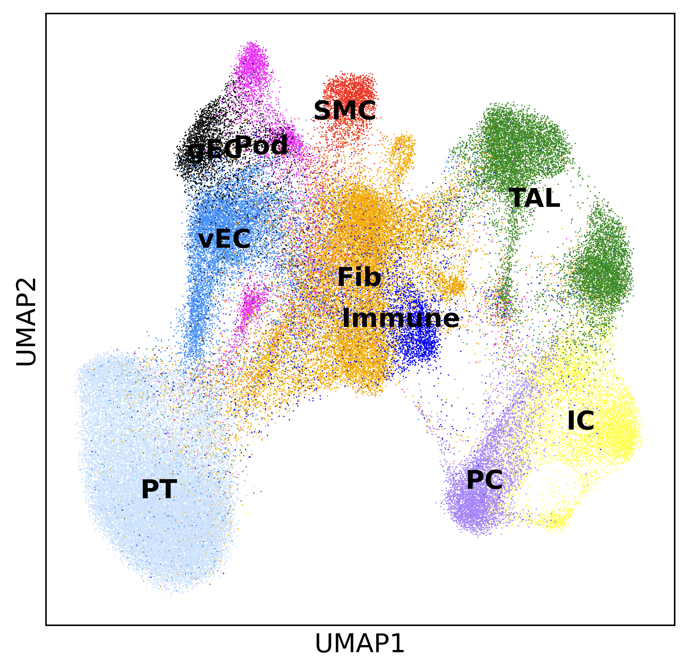
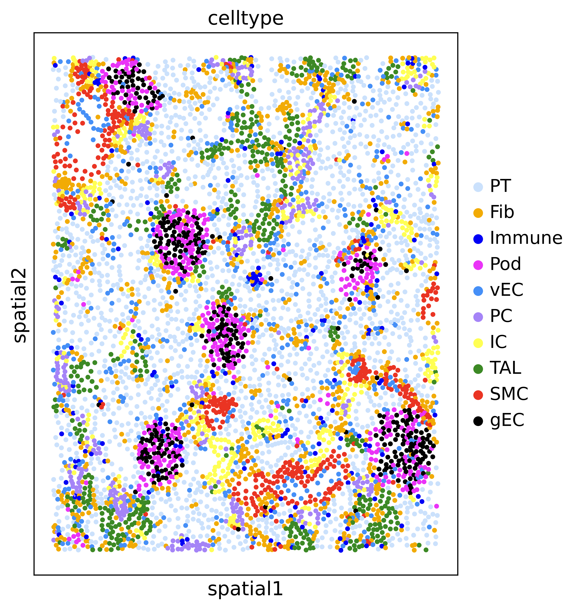
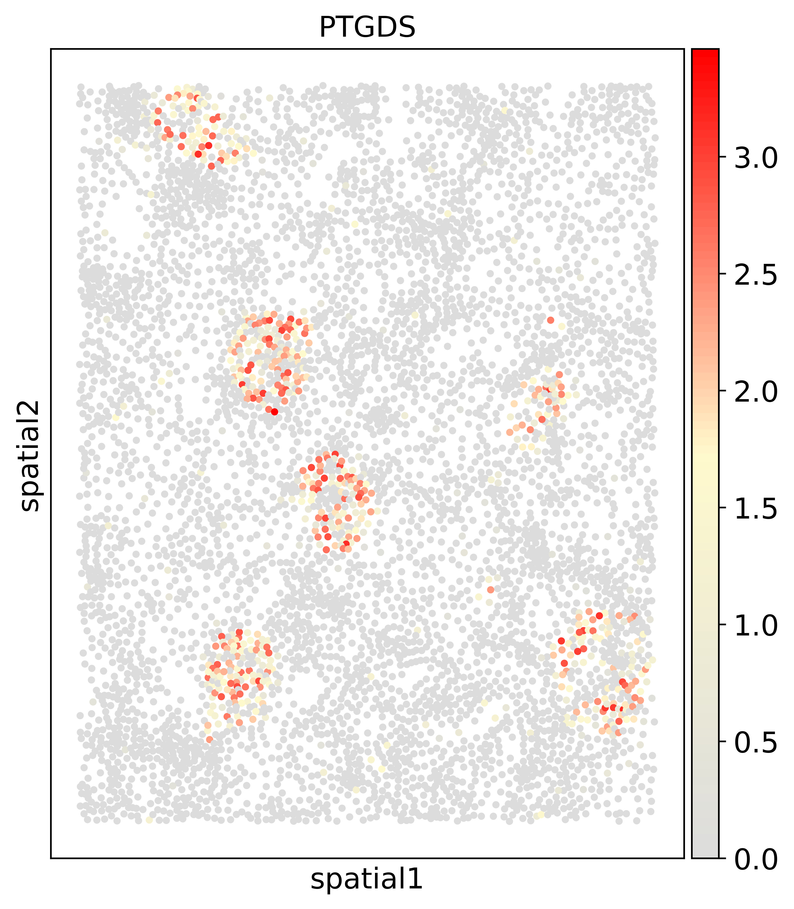

```python
import numpy as np
import pandas as pd
import matplotlib.pyplot as plt
import seaborn as sns
import scanpy as sc
import squidpy as sq
```

    /home/haojiawu/anaconda3/lib/python3.11/site-packages/geopandas/_compat.py:124: UserWarning: The Shapely GEOS version (3.11.1-CAPI-1.17.1) is incompatible with the GEOS version PyGEOS was compiled with (3.10.4-CAPI-1.16.2). Conversions between both will be slow.
      warnings.warn(
    /home/haojiawu/anaconda3/lib/python3.11/site-packages/spatialdata/__init__.py:9: UserWarning: Geopandas was set to use PyGEOS, changing to shapely 2.0 with:
    
    	geopandas.options.use_pygeos = True
    
    If you intended to use PyGEOS, set the option to False.
      _check_geopandas_using_shapely()


```python
adata = sc.read_10x_h5(
    filename="human_kidney_xenium/cell_feature_matrix.h5"
)
```


```python
df = pd.read_csv(
    "human_kidney_xenium/cells.csv.gz"
)
```


```python
df.set_index(adata.obs_names, inplace=True)
adata.obs = df.copy()
```


```python
adata.obsm["spatial"] = adata.obs[["x_centroid", "y_centroid"]].copy().to_numpy()
```


```python
sc.pp.filter_cells(adata, min_counts=1)
sc.pp.filter_genes(adata, min_cells=1)
adata
```


    AnnData object with n_obs × n_vars = 97511 × 377
        obs: 'cell_id', 'x_centroid', 'y_centroid', 'transcript_counts', 'control_probe_counts', 'control_codeword_counts', 'unassigned_codeword_counts', 'deprecated_codeword_counts', 'total_counts', 'cell_area', 'nucleus_area', 'n_counts'
        var: 'gene_ids', 'feature_types', 'genome', 'n_cells'
        obsm: 'spatial'


```python
adata.layers["counts"] = adata.X.copy()
sc.pp.normalize_total(adata, inplace=True)
sc.pp.log1p(adata)
sc.pp.pca(adata)
sc.pp.neighbors(adata)
sc.tl.umap(adata)
sc.tl.leiden(adata)
```

    /home/haojiawu/anaconda3/lib/python3.11/site-packages/umap/distances.py:1063: NumbaDeprecationWarning: The 'nopython' keyword argument was not supplied to the 'numba.jit' decorator. The implicit default value for this argument is currently False, but it will be changed to True in Numba 0.59.0. See https://numba.readthedocs.io/en/stable/reference/deprecation.html#deprecation-of-object-mode-fall-back-behaviour-when-using-jit for details.
      @numba.jit()
    /home/haojiawu/anaconda3/lib/python3.11/site-packages/umap/distances.py:1071: NumbaDeprecationWarning: The 'nopython' keyword argument was not supplied to the 'numba.jit' decorator. The implicit default value for this argument is currently False, but it will be changed to True in Numba 0.59.0. See https://numba.readthedocs.io/en/stable/reference/deprecation.html#deprecation-of-object-mode-fall-back-behaviour-when-using-jit for details.
      @numba.jit()
    /home/haojiawu/anaconda3/lib/python3.11/site-packages/umap/distances.py:1086: NumbaDeprecationWarning: The 'nopython' keyword argument was not supplied to the 'numba.jit' decorator. The implicit default value for this argument is currently False, but it will be changed to True in Numba 0.59.0. See https://numba.readthedocs.io/en/stable/reference/deprecation.html#deprecation-of-object-mode-fall-back-behaviour-when-using-jit for details.
      @numba.jit()
    /home/haojiawu/anaconda3/lib/python3.11/site-packages/umap/umap_.py:660: NumbaDeprecationWarning: The 'nopython' keyword argument was not supplied to the 'numba.jit' decorator. The implicit default value for this argument is currently False, but it will be changed to True in Numba 0.59.0. See https://numba.readthedocs.io/en/stable/reference/deprecation.html#deprecation-of-object-mode-fall-back-behaviour-when-using-jit for details.
      @numba.jit()


```python
sc.pl.umap(
    adata,
    color=[
        "leiden",
        "UMOD"
    ],
    wspace=0.4,
)
```

    /home/haojiawu/anaconda3/lib/python3.11/site-packages/scanpy/plotting/_tools/scatterplots.py:392: UserWarning: No data for colormapping provided via 'c'. Parameters 'cmap' will be ignored
      cax = scatter(


    

    


```python
#adata.write("scanpy_kidney.h5ad")
```


```python
sq.pl.spatial_scatter(
    adata,
    color="leiden",
    shape=None,
    size=2
)
```

    WARNING: Please specify a valid `library_id` or set it permanently in `adata.uns['spatial']`


    /home/haojiawu/anaconda3/lib/python3.11/site-packages/squidpy/pl/_spatial_utils.py:956: UserWarning: No data for colormapping provided via 'c'. Parameters 'cmap', 'norm' will be ignored
      _cax = scatter(


    

    


```python
meta = pd.read_csv("kidney_xenium_meta.csv")
```


```python
adata.obs["celltype"] = meta["celltype"].tolist()
```


```python
import matplotlib.colors as color
```


```python
colors2=color.ListedColormap(["#cbe1fc","#f2ab05","#0000f5","#ea33f7", "#458ff7","#a584f7","#ffff54","#3c8925", "#ea3423","#000000"])
```


```python
cell_order = ['PT','Fib','Immune',"Pod",'vEC','PC','IC','TAL','SMC','gEC']
adata.obs['celltype']=adata.obs['celltype'].astype('category')
adata.obs['celltype']=adata.obs['celltype'].cat.reorder_categories(cell_order)
```


```python
sc.settings.set_figure_params(dpi=300, facecolor='white')

```


```python
sq.pl.spatial_scatter(
    adata,
    color="celltype",
    shape=None,
    size=0.5,
    palette=colors2,
    figsize=(12, 6)
)
```

    WARNING: Please specify a valid `library_id` or set it permanently in `adata.uns['spatial']`


    /home/haojiawu/anaconda3/lib/python3.11/site-packages/squidpy/pl/_spatial_utils.py:956: UserWarning: No data for colormapping provided via 'c'. Parameters 'cmap', 'norm' will be ignored
      _cax = scatter(


    

    


```python
with plt.rc_context({"figure.figsize": (6, 6), "figure.dpi": (300)}):
    sc.pl.umap(adata, color='celltype', legend_loc='on data', title='', size=2, )
```

    /home/haojiawu/anaconda3/lib/python3.11/site-packages/scanpy/plotting/_tools/scatterplots.py:392: UserWarning: No data for colormapping provided via 'c'. Parameters 'cmap' will be ignored
      cax = scatter(


    

    


```python
with plt.rc_context({"figure.figsize": (6, 6), "figure.dpi": (300)}):
    sq.pl.spatial_scatter(
        adata,
        color="celltype",
        shape=None,
        size=24,
        palette=colors2,
        crop_coord=[(3580.04, 1162.36, 4474.28, 2304.39)]
    )
```

    WARNING: Please specify a valid `library_id` or set it permanently in `adata.uns['spatial']`


    /home/haojiawu/anaconda3/lib/python3.11/site-packages/squidpy/pl/_spatial_utils.py:956: UserWarning: No data for colormapping provided via 'c'. Parameters 'cmap', 'norm' will be ignored
      _cax = scatter(


    

    


```python
from matplotlib.colors import LinearSegmentedColormap
cmap_name = "expr color"
colors = ["gainsboro","lemonchiffon", "red"]
n_bins = 100
custom_cmap = LinearSegmentedColormap.from_list(cmap_name, colors, N=n_bins)
```


```python
with plt.rc_context({"figure.figsize": (6, 6), "figure.dpi": (300)}):
    sq.pl.spatial_scatter(
        adata,
        color="PTGDS",
        shape=None,
        size=24,
        palette=colors2,
        crop_coord=[(3580.04, 1162.36, 4474.28, 2304.39)], 
        cmap=custom_cmap
    )
```

    WARNING: Please specify a valid `library_id` or set it permanently in `adata.uns['spatial']`


    

    


```python

```
